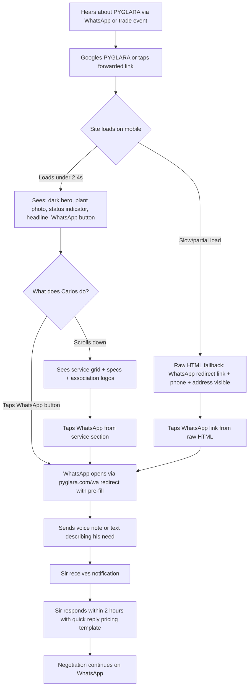
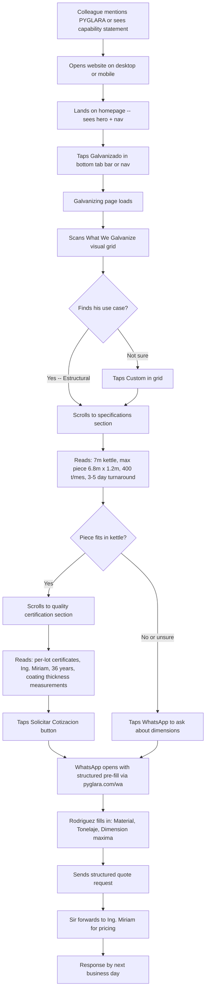
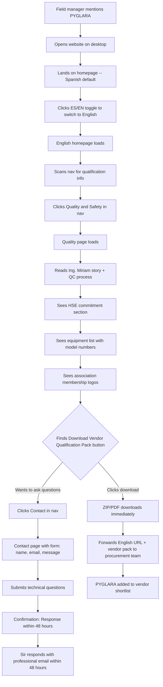
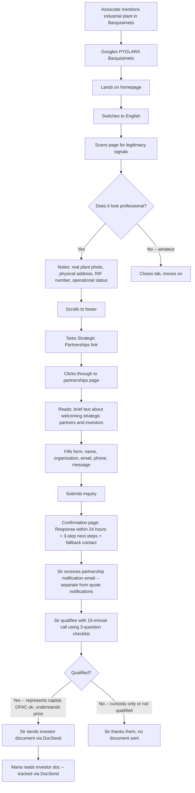
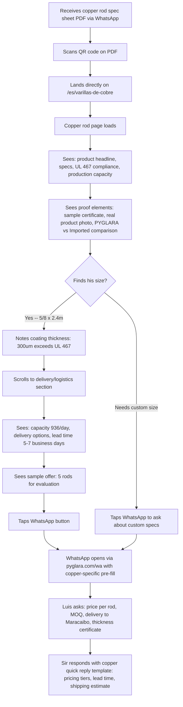
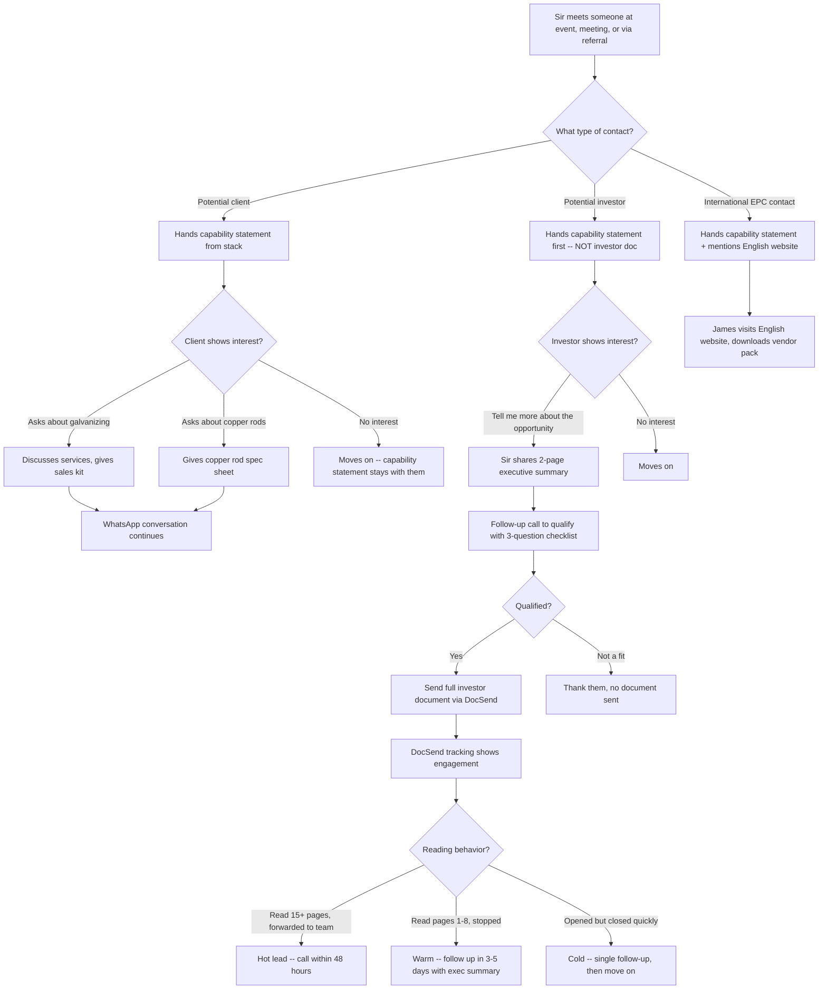
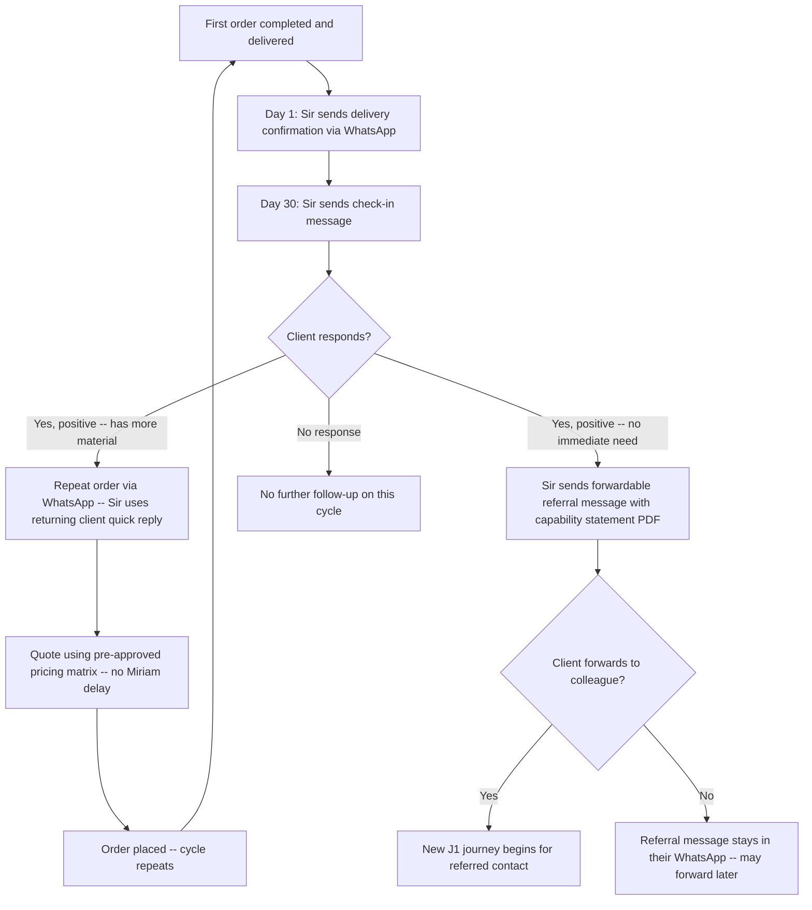

# UX Design Specification PYG

**Author:** Sir
**Date:** 2026-03-19

---

## Executive Summary

### Project Vision

PYGLARA (Prensados y Galvanizados de Lara, S.A.) requires two independent deliverables with a revised priority order driven by business reality:

**Priority 1 — Investor Document (Offline PDF):** A comprehensive, bilingual, investor-grade document designed as the primary tool for capital acquisition. Client interest already exists through existing relationships and the active 3m kettle — finding investors/partners is the bottleneck. Every week without this document is a missed meeting. The document is never published online; shared only after Sir qualifies the lead.

**Priority 2 — Bilingual Website (ES/EN):** A credibility verification layer and lead amplifier for existing word-of-mouth traction. The website is NOT a lead-generation engine — it's a referral validation tool. When someone hears about PYGLARA via WhatsApp or a trade contact, the site confirms "these people are real and professional." The actual sales happen on WhatsApp and phone.

**Core Insight (First Principles):** Venezuelan B2B runs on WhatsApp, not the web. The website's real competitor isn't ALF's website — it's doing nothing and staying on WhatsApp only. PDFs (capability statement, copper rod spec sheet, investor document) are the actual primary touchpoints — they get forwarded in WhatsApp groups and email chains. The website is the backup verification layer behind them.

### Target Users

Six distinct user personas with four distinct entry modes:

| User | Context | Device | Language | Primary Need | Entry Mode |
|---|---|---|---|---|---|
| **Carlos** — Ferretería owner, Caracas | Heard via referral, checking on the spot | Mobile | Spanish | WhatsApp contact + credibility check | Quick validation — 5 seconds to WhatsApp |
| **Ing. Rodriguez** — Construction PM, Barquisimeto | Needs specs for a project bid | Desktop/Mobile | Spanish | Technical specs + quote form | Content scanning — reads specs, submits quote |
| **James** — EPC Procurement, Houston | Evaluating Venezuelan vendors | Desktop | English | HSE policy, vendor qualification pack, capability PDF | Vendor due diligence — checkbox exercise |
| **Maria** — Family Office Advisor, Miami | Exploring Venezuela investments | Desktop | English | Anti-fraud verification + discreet partnership inquiry | Legitimacy verification — address, RIF, real photos |
| **Luis** — Electrical Contractor, Maracaibo | Needs copper ground rods | Mobile | Spanish | Copper rod specs, pricing, delivery to Zulia | Product purchase — not service inquiry |
| **Sir** — Site Admin | Manages inquiries, updates content | Desktop | Both | Email notifications + easy content updates | Admin — forward-friendly emails, code-level edits |

### Key Design Challenges

**Challenge 1: Dual-audience separation.** Client content and investor inquiry must coexist without confusing either audience. A ferretería owner should never feel like they're on an investment pitch site. An investor should find the inquiry path without wading through tonnage specs. **Solution:** 4-item nav for clients, partnership inquiry in footer only (self-selecting by behavior).

**Challenge 2: Bilingual with language-specific optimization.** Not just translated text — different emphasis per language. Spanish pages optimized for phone-screen readability and WhatsApp sharing. English pages optimized for browser tab previews, Slack unfurls, LinkedIn sharing, and screenshot-forwarding in corporate communication. Open Graph meta tags critical for English pages.

**Challenge 3: Mobile-first on intermittent internet.** Venezuelan mobile data drops entirely for seconds at a time. Pages requiring multiple sequential HTTP requests fail silently. **Solution:** Fault-tolerant design — WhatsApp link, phone number, and address in raw HTML (not JS-dependent). System fonts only. Progressive image loading. Critical contact paths work even if page renders partially.

**Challenge 4: Phased operational messaging.** The 3m kettle is active NOW, the 7m is near-term (Q2 2026), the 9m is future (2027). **Reframed as opportunity:** Operational transparency is a TRUST SIGNAL. A company honest about its current state is more trustworthy than one claiming full capacity on day one. Visual timeline, not a caveat.

**Challenge 5: WhatsApp as primary conversion path.** In Venezuelan B2B, the sale happens on WhatsApp, not a website form. **Solution:** WhatsApp is THE hero CTA. Forms exist only for formal/international use (James, Maria). Venezuelan clients get WhatsApp-native flows.

**Challenge 6: Pricing transparency vs. regulatory compliance.** Users expect to see prices, but Ley de Precios Justos makes public pricing a regulatory target. **Resolution (First Principles):** Zero pricing on website — this is not a UX weakness, it's how Venezuelan B2B works. Everyone expects to negotiate privately. "Solicite su cotización" is the only pricing CTA.

**Challenge 7: Two distinct purchase journeys.** Galvanizing is a SERVICE inquiry (bring your steel, get a quote). Copper rods are a PRODUCT purchase (specs, MOQ, pricing, delivery). These need separate UX paths, separate nav items, and separate distribution assets.

**Challenge 8: HSE visibility as EPC gating criterion.** James cannot add PYGLARA to his vendor shortlist without an HSE policy. This must be prominent on the English site — a blocker for the international funnel. Combined with quality certification on a single trust page.

**Challenge 9: Distribution design.** How site content gets shared OFF the site (WhatsApp forwards, PDF spec sheets, capability statement) is more important than on-site UX in Venezuelan B2B. Every key asset must be designed for shareability.

**Challenge 10: Investor document as UX product.** The investor document has its own user journey, information architecture, visual design, and conversion goals. It requires full UX treatment — not an afterthought.

### Design Opportunities

**Opportunity 1: PDFs as primary touchpoints.** The capability statement, copper rod spec sheet, and investor document receive full UX design attention as actual first-contact materials. A combined 3-page "PYGLARA Sales Kit" PDF (capability overview + copper rod specs + how to order with WhatsApp QR code) becomes Sir's default distribution weapon. Individual spec sheets exist for targeted campaigns.

**Opportunity 2: Cross-sell through natural proximity.** No competitor offers both galvanizing AND copper ground rods. Cross-sell is ambient and contextual — copper rod visibility on galvanizing pages (and vice versa), never interrupting the primary journey. The combined Sales Kit PDF delivers cross-sell naturally — both services in one document.

**Opportunity 3: Quality certification + Ing. Miriam as trust differentiator.** Per-lot quality certificates signed by a 36-year veteran engineer is unusual for Venezuela. The Quality & Safety page opens with Ing. Miriam's story — the human IS the quality proof in Venezuelan B2B. Technical QC process and HSE commitment follow. Real people > anonymous testimonials.

**Opportunity 4: Geographic advantage as visual UX element.** PYGLARA is 350km closer than ALF for all of western Venezuela. A coverage map (simple SVG, not heavy Google Maps) showing the catchment area with transport savings turns an abstract advantage into a visual argument.

**Opportunity 5: Operational status indicator.** Homepage features a live status signal: "🟢 Planta Operativa — Aceptando Pedidos" with kettle timeline (3m active | 7m: Q2 2026 | 9m: 2027). Signals life, shows trajectory, creates urgency. Updates as each kettle comes online.

**Opportunity 6: Downloadable capability statement PDF.** Serves international procurement (James attaches to vendor form), word-of-mouth (Carlos forwards on WhatsApp), and LinkedIn sharing. The site's most important viral asset — documents get forwarded in Venezuelan B2B, not links.

**Opportunity 7: "Real Over Polished" design principle.** Authentic plant photos (phone quality OK — visual walk-through sequence of 8-10 photos simulating a plant visit), named people (Ing. Miriam, Sir), verifiable address and RIF. The site should feel like visiting the plant, not reading a corporate brochure. Zero stock imagery.

**Opportunity 8: DocSend-style investor document delivery.** Instead of raw PDF email attachment, send via tracking link ($10/month). Sir sees when Maria opened the document, which pages she read, and whether she forwarded it. Follow-up intelligence without asking.

**Opportunity 9: WhatsApp Business optimization (MVP).** Auto-reply for instant acknowledgment, quick replies (pre-saved spec sheets, pricing templates, FAQ answers), product catalog inside WhatsApp. 80% of a chatbot's value at zero cost. Full WhatsApp chatbot deferred to Phase 2 when inquiry volume exceeds Sir's capacity (~10+/day).

### Navigation Architecture

**4-item main nav + footer partnership link:**

```
Galvanizado / Galvanizing        ← SERVICE (Rodriguez, Carlos)
Varillas de Cobre / Copper Rods  ← PRODUCT (Luis)
Calidad y Seguridad / Quality    ← TRUST (James, Rodriguez, Ing. Miriam story)
Contacto / Contact               ← GENERAL (quote form for international, WhatsApp for Venezuelan)
```

- Logo/brand links home
- Language toggle as separate UI element (ES|EN) in header
- WhatsApp: persistent floating button on mobile, header icon on desktop
- "Alianzas Estratégicas / Strategic Partnerships" in footer only — self-selecting for sophisticated users (Maria)
- **Mobile: bottom tab bar (not hamburger)** — 4 tabs always visible, reachable with thumb, familiar pattern

### Homepage Design Principles

- **Photo-first, text-second.** Opens with full-bleed plant photo (the 7m kettle, industrial, real). No text overlay except PYGLARA logo.
- **Confirmation, not conversion.** Users arrive with intent already formed via referral. Homepage confirms legitimacy: real photo, operational status, WhatsApp button.
- **Minimal content:** Operational status indicator → four nav options → one-line description → WhatsApp CTA
- **Carlos test:** Can he find WhatsApp in under 5 seconds without scrolling? If no, redesign.

### Contact Architecture

- **Venezuelan clients (Carlos, Rodriguez, Luis):** WhatsApp-native quote flow. "Solicitar Cotización" button opens WhatsApp with structured pre-fill per page context (galvanizing vs. copper rods). No web form needed.
- **International clients (James):** Web-based quote form with file attachment support (PDF, DWG, images). Email confirmation with reference number. Formal paper trail.
- **Investor inquiries (Maria):** Footer-linked partnership inquiry form (name, organization, email, phone, message). Separate email notification to Sir.
- **General contact form: ELIMINATED.** Redundant. Footer shows phone, WhatsApp, email, and address on every page.
- **Context-aware WhatsApp pre-fills:** Different pre-filled messages per page. Galvanizing page: "Hola, me interesa el servicio de galvanizado." Copper rod page: "Hola, me interesan las varillas de puesta a tierra." Homepage: generic greeting.
- **Confirmation pages (FR10b):** Set response time expectations — "Respuesta en menos de 2 horas en horario laboral" for quotes, "24 horas" for partnership inquiries (investor priority). Includes fallback contact info and 3-step next-steps sequence for partnership inquiries.

### Investor Document UX

**Priority 1 deliverable — full UX treatment required.**

**Reading order (rearranged for investor psychology — lead with the ask, then justify):**
1. Executive Summary WITH the investment ask ($1M, what you get)
2. Operational Status (3m active, 7m plan, 9m future — it's already running)
3. Financial Projections at 30% regulated margin (show the money first)
4. Capital Deployment Timeline + path-to-first-revenue
5. Market Thesis (why it grows — $183B, construction wave, oil sector)
6. Competitive Landscape (why it's defensible — geographic moat, dual capability)
7. Plant Capabilities & Asset Inventory (what you're buying)
8. Management & Operations (Ing. Miriam's role, continuity plan)
9. Deal Structure Options (equity, revenue-share, full acquisition)
10. SWOT Analysis (honest risks — last, after they're already interested)
11. Contact & Next Steps

**Design principles:**
- Two separate language versions (not one bilingual document)
- 25-35 pages per version
- Professional typography with data visualizations for financial projections
- Reading time estimate on cover ("25-minute read")
- Executive summary must stand alone as a 2-page version for initial qualification
- Modular design — core sections for all audiences, audience-specific appendices (financial projections for investors, capacity certifications for PDVSA vendor registration, facility specs for insurers)
- Delivery via DocSend or similar tracking service ($10/month) — engagement analytics for follow-up intelligence

**Secondary audiences for modular investor document:**
- Zinc suppliers (capacity trajectory for volume pricing negotiation)
- Banks (working capital line applications)
- PDVSA vendor registration (capability documentation)
- Insurance underwriters (facility specifications)

### Admin UX (Sir)

- Email notifications separated by type (quote vs. partnership inquiry)
- Email format: forward-friendly with ALL details inline — no "click here to view"
- Spam protection on forms (honeypot + rate limiting — lightweight, no CAPTCHA friction)
- Content updates via code commits for MVP (CMS deferred to Phase 2)
- WhatsApp Business quick replies for fast response with pre-saved templates

### Design Principles Summary

| Principle | Rationale |
|---|---|
| **PDFs first, website second** | Documents get forwarded in Venezuelan B2B; links don't |
| **Real over polished** | Trust is personal in Venezuela; authentic photos and named people > corporate brochure |
| **WhatsApp is the platform** | 80%+ of Venezuelan B2B transactions happen on WhatsApp |
| **Zero pricing on-site** | Ley de Precios Justos compliance + Venezuelan B2B cultural norm |
| **Confirmation, not conversion** | Users arrive with referral intent; site confirms legitimacy |
| **Fault-tolerant on intermittent internet** | Critical paths (WhatsApp, phone, address) in raw HTML, no JS dependency |
| **Language = implicit segmentation** | Spanish for mobile WhatsApp validation; English for corporate screenshot/forwarding |
| **Bottom tabs over hamburger** | Always visible, thumb-reachable, familiar to Venezuelan mobile users |
| **Photo-first homepage** | The plant photo IS the pitch — proves "we're real" louder than any headline |
| **Ambient cross-sell** | Copper + galvanizing visibility through proximity, never interruption |

### Visual Menu Layout (Services Presentation)

Adapted from the familiar WhatsApp menu image pattern used in Venezuelan B2B:

| What We Galvanize | Capacity | Action |
|---|---|---|
| Structural steel (vigas, columnas) | Up to 7m pieces | WhatsApp → |
| Roofing / láminas | Bulk batches | WhatsApp → |
| Guardrails / barandas | Standard sizes | WhatsApp → |
| Custom / industrial | Consult | WhatsApp → |

Scannable on a phone in seconds. Rodriguez clicks through for detailed specs; Carlos gets what he needs in one screen.

### Persona Journey Validation (Against Final Architecture)

| Persona | Journey Through Final Architecture | Result |
|---|---|---|
| **Carlos** (mobile, ES) | Homepage → sees plant photo + WhatsApp floating button → taps WhatsApp → done | ✅ Never touches nav |
| **Rodriguez** (desktop, ES) | Homepage → "Galvanizado" tab → specs, capacity, quality cert → "Solicitar Cotización" WhatsApp pre-fill or form | ✅ Gets specs + quote path |
| **Luis** (mobile, ES) | Homepage → "Varillas de Cobre" bottom tab → rod specs, UL 467, sizes → WhatsApp with copper pre-fill | ✅ Direct product path |
| **James** (desktop, EN) | Homepage → EN toggle → "Quality & Safety" → HSE + QC + capability PDF download → "Contact" → formal form | ✅ Vendor qualification complete |
| **Maria** (desktop, EN) | Homepage → EN toggle → scrolls to footer → "Strategic Partnerships" → inquiry form | ✅ Discreet, self-selecting |
| **Sir** (admin) | Receives typed email notifications → forwards quote to Miriam, schedules investor call | ✅ Forward-friendly emails |

### LinkedIn / Social Optimization (English Pages)

English pages include optimized Open Graph meta tags for professional sharing:
- Clean preview image (plant photo with PYGLARA brand)
- Compelling description per page
- Professional title formatting
- Designed for LinkedIn unfurls and Slack previews — the English site doubles as content for Sir's LinkedIn outreach strategy

## Core User Experience

### Defining Experience

PYG's core user experience is **print-first, WhatsApp-connected, website-backed.**

The defining interaction is the **physical handoff**: Sir meets a potential client, investor, or partner, and hands them the right printed document from his meeting kit. Within 30 seconds of receiving that document, the person understands: (1) what PYGLARA does, (2) why it matters to them specifically, and (3) how to reach Sir immediately (phone, WhatsApp QR code, email — on every page).

The core UX is not about documents — it's about **conversation design with printed props.** Each document is a step in a relationship progression, and Sir's verbal pitch fills the space between them.

The website serves as the digital verification layer — when someone Googles PYGLARA after a meeting, after receiving a forwarded PDF, or after hearing the name on WhatsApp. The site confirms what the printed materials and personal interactions already established.

**Priority hierarchy of touchpoints:**

1. **Printed meeting kit** — Sir's primary sales tool (investor doc, sales kit, spec sheets)
2. **WhatsApp** — Where conversations continue after handoff and where Venezuelan B2B transactions happen
3. **PDF versions of printed materials** — Forwarded digitally via WhatsApp and email
4. **Website** — Verification layer and international discovery path

### Platform Strategy

**Print Platform (Primary):**

- Carta (Letter) paper size — Venezuelan standard
- Must render well on both color and black-and-white printers
- High-resolution photography (300 DPI minimum for print)
- Typography optimized for print legibility — minimum 10pt body text, high contrast
- QR code on every page linking to WhatsApp Business
- Contact info (phone, WhatsApp, email, address) on every page footer
- Documents designed as separable pages — any single page pulled from the stack must work independently

**Physical Form Factor Differentiation (Stack Design):**

Sir's meeting kit is a designed system, not a pile of papers. Each document has a distinct physical format so Sir can pull the right one in 2 seconds without looking:

| Document | Size | Stock | Weight | Identifier |
|---|---|---|---|---|
| **Investor Document** (25-35 pg) | Full Carta, bound | White cover stock | Heavy — feels premium | Bound spine + cover |
| **Sales Kit** (3 pg) | Half-carta fold or tri-fold | White | Standard | Different physical form factor — foldable |
| **Copper Rod Spec Sheet** (1 pg) | Full Carta | Light blue or copper-tone stock | Standard | Color stands out in any stack |
| **Capability Statement** (1 pg) | Full Carta | White | Standard | Clean, simple — the "business card" |

**Dual-Mode Readability:**

Documents under 3 pages must pass both the print test AND the WhatsApp phone-screen PDF preview test. When a prospect opens the Sales Kit or spec sheet as a PDF attachment in WhatsApp mobile, the text must be legible without zooming. This means:

- Minimum 12pt body text for short documents (larger than the 10pt print minimum)
- High-contrast typography that survives phone-screen compression
- Key information (headline, contact, QR) readable at phone-screen zoom level
- The investor document is print/laptop only — acceptable for its audience (Maria reads on desktop)

**Scalable Distribution by Design:**

The capability statement and copper rod spec sheet must be printable on any office printer at near-zero cost. If it costs Sir $0.20/copy, he prints 200 and leaves stacks at ferreterías, construction offices, and trade events. These become physical distribution nodes — the ferretería owner hands them to anyone who asks about galvanizing.

- Single page, no bleed, no special stock required
- Works in full color AND black-and-white without losing information
- No expensive finishing (no lamination, no spot UV, no die cuts)
- QR code and contact info survive photocopy quality

**WhatsApp Platform (Secondary):**

- WhatsApp Business profile with catalog, auto-reply, quick replies
- PDF documents optimized for WhatsApp forwarding (<16MB per file, compressed for mobile download)
- WhatsApp-native quote flow with structured pre-fills per service type
- Quick reply templates for common responses (galvanizing specs, copper rod specs, pricing process)
- Auto-reply: instant acknowledgment + business hours + expected response time

**Web Platform (Tertiary):**

- Static site on Vercel (SSG, global CDN)
- Mobile-first responsive (bottom tab nav, not hamburger)
- Bilingual (ES/EN) with route-based i18n
- System fonts, progressive image loading, fault-tolerant rendering
- Optimized for Venezuelan intermittent internet (<500KB pages, critical paths in raw HTML)
- English pages optimized for LinkedIn/Slack unfurls (Open Graph meta)

### Document Escalation Flow

The meeting kit follows a relationship progression — each document earns the right to the next conversation:

```text
FIRST TOUCH                    INTEREST SIGNAL                QUALIFIED HANDOFF
─────────────                  ───────────────                ─────────────────
Capability Statement    →      Prospect asks a question  →    Client path:
(casual handoff,               or mentions a project          Sales Kit + Copper
"take a look")                                                Rod Spec Sheet

                               Prospect mentions              Investor path:
                               investment, partnership,        Investor Document
                               or "tell me more about         (bound, premium)
                               the opportunity"

FOLLOW-UP
─────────
WhatsApp conversation continues. PDF versions forwarded
to prospect's team. Website validates if they Google.
DocSend tracking informs Sir's follow-up timing.
```

The capability statement is the business card equivalent. The investor document is the deep engagement piece. You don't hand someone the investor document cold — the capability statement earns that conversation.

Each document needs a **HOOK** — one number or statement that makes the prospect say "tell me more." The capability statement isn't just a summary; it's a curiosity generator.

### Effortless Interactions

| Interaction | Must Feel Effortless | How |
|---|---|---|
| **Sir pulls right document from stack** | 2 seconds, no flipping through pages | Distinct physical form factors — size, weight, stock color |
| **Sir hands document to prospect** | Right document for right person, instantly | Escalation ladder guides which document to give when |
| **Prospect finds WhatsApp from printed page** | Scan QR → conversation open in 3 seconds | QR code prominent on every page, tested on iOS and Android |
| **Prospect reads opening line** | Understands why this matters in 10 seconds | "Story first, specs second" — opening line answers "why" before "what" |
| **Carlos validates PYGLARA on phone** | Homepage → WhatsApp in under 5 seconds | Photo-first homepage, floating WhatsApp button, zero scrolling |
| **Rodriguez gets a quote started** | WhatsApp pre-fill with structured template | One tap from galvanizing page opens WhatsApp with quote fields |
| **James downloads vendor qualification pack** | One click → complete PDF package | "Download Vendor Pack" button on Quality & Safety page (EN) |
| **Maria finds partnership inquiry** | Footer link → simple form → confirmation | Self-selecting placement, no content clutter |
| **Maria reads investor doc executive summary** | Decides "worth a deeper look" in 2 minutes | Investment ask on page 1, operational status page 2, financials page 3 |
| **Anyone with a single page contacts Sir** | Every page has complete contact info | Phone, WhatsApp QR, email, address in footer of every page |
| **Ferretería owner distributes for Sir** | Hands out capability statements from his counter | Cheap to print, works B&W, professional enough to share |

### Critical Success Moments

**Moment 1: The 30-Second Handoff (Print)**
Sir hands a document to someone. In 30 seconds they either think "this is professional, these people are serious" or "this looks amateur." The cover page, paper quality, layout density, and opening line determine the outcome. This is the single most important UX moment across all of PYG's materials.

**Moment 2: The Opening Line Hook (Print)**
The first sentence on any PYGLARA document answers "Why does this matter?" before "What is this?" This is Sir's pitch when he's not in the room — when the document is forwarded, left on a desk, or pulled from a stack weeks later. If the opening line doesn't create curiosity, the rest of the document doesn't get read.

**Moment 3: The 5-Second WhatsApp Bridge (Print → Digital)**
After reading a printed document, the prospect picks up their phone and scans the QR code. WhatsApp opens with a pre-filled greeting. The transition from paper to digital conversation must be instant and frictionless. If the QR code doesn't work, or opens a generic chat without context, the momentum is lost.

**Moment 4: The 2-Minute Investor Decision (Print)**
Maria opens the investor document. Page 1: investment ask and what she gets. Page 2: the plant is already operational. Page 3: the numbers at 30% regulated margin. By minute 2, she either flags it for her committee or puts it in the "pass" pile. The first 3 pages must be self-contained and compelling.

**Moment 5: The Referral Validation (Web)**
Carlos Googles "PYGLARA" after hearing the name at a trade event. He lands on the homepage. Real plant photo. Operational status indicator. WhatsApp button. In 5 seconds he confirms "this is real" and taps WhatsApp. If the site looks like a template, loads slowly, or doesn't show WhatsApp immediately — he closes the tab and calls the Valencia guy instead.

**Moment 6: Sir's Informed Follow-Up (Digital Tracking)**
Sir sent the investor document to Maria via DocSend two days ago. He checks the dashboard: she opened it, read 18 pages, spent 3 minutes on the financials section, and forwarded it to one other person. Sir knows to call NOW — she's engaged and sharing it with her committee. Without tracking, Sir would be guessing. The admin UX for digital document delivery is as important as the print design.

### Experience Principles

| # | Principle | What It Means In Practice |
|---|---|---|
| 1 | **Story first, specs second** | Every document's opening line answers "Why does this matter?" before "What is this?" The first sentence is Sir's pitch when he's not in the room. |
| 2 | **Print drives, digital follows** | Design documents for print first, then adapt for screen. The printed handoff is the primary UX; the website is the echo. Short docs must also pass the phone-screen test. |
| 3 | **Every printed page stands alone** | Any single PRINTED page (capability statement, spec sheet, sales kit), if separated from the stack, must contain: what PYGLARA does, a key capability, and complete contact info with WhatsApp QR. Does NOT apply to the investor document, which is a bound sequential document with contact info on cover and final page only. |
| 4 | **Design the stack, not just the pages** | Each document has a distinct physical form factor (size, weight, stock color). Sir identifies and pulls the right document in 2 seconds without flipping. |
| 5 | **Escalate, don't dump** | Each document earns the right to the next conversation. Capability statement → Sales Kit → Investor Document. Never hand the investor document cold. |
| 6 | **30 seconds to "these people are serious"** | Every touchpoint — printed page, website homepage, WhatsApp catalog — must create a professional credibility impression within 30 seconds. |
| 7 | **WhatsApp is the destination** | Every touchpoint funnels to WhatsApp. Printed QR codes, website buttons, email signatures — all roads lead to a WhatsApp conversation with Sir. |
| 8 | **Real over polished** | Authentic plant photos, named people, verifiable address. Trust in Venezuela is personal. The materials should feel like meeting a person, not reading a corporate brochure. |
| 9 | **Scalable distribution by design** | Capability statement and spec sheets printable on any office printer at near-zero cost. Volume distribution is how word-of-mouth gets physical form. |
| 10 | **Fault-tolerant at every layer** | Print works without internet. QR works without the website. Website works on partial load. WhatsApp works without the website. No single point of failure. |

## Desired Emotional Response

### Primary Emotional Goals

**Overarching Emotional Signature:** *"Venezuela is rebuilding, and these people are ready."*

Every PYGLARA touchpoint — printed document, WhatsApp conversation, website page — should leave this single conviction lingering. Not "buy this." Not "invest now." A quiet confidence that this plant is positioned at the right place and right time, and the people behind it are competent.

**Sir's Emotional Goal (The Presenter):** Pride and control. When Sir hands someone a document, he feels like a professional representing a serious operation. He knows which document to pull, he's confident it will make the right impression, and he never worries about what's inside.

### Emotional Journey Mapping

| Touchpoint | User | Desired Emotion | Emotional Shift |
|---|---|---|---|
| **Capability statement handed at event** | Carlos, Rodriguez, anyone | "These people are real and close by" | Curiosity → Credibility confirmation → "I should call them" |
| **Sales Kit reviewed after meeting** | Carlos, Rodriguez | "This is a serious local operation I can work with" | Interest → Technical confidence → Action (WhatsApp) |
| **Copper rod spec sheet received** | Luis | "Finally, I don't have to import" | Surprise (domestic option exists) → Relief (specs match needs) → Urgency (order before they run out) |
| **Website homepage on mobile** | Carlos, Luis | "Yep, this is real" | Skepticism → Instant validation (real photo, real address) → WhatsApp tap |
| **Website in English** | James | "I can put my name behind this recommendation" | Professional scanning → Surprise ("Venezuelan plant presents this well") → Confidence to forward to team |
| **Footer partnership link** | Maria | "These people are professional enough to take seriously" | Curiosity → Legitimacy verified (address, RIF, real photos) → Inquiry submitted |
| **Investor document, pages 1-3** | Maria | "This is the most organized Venezuelan opportunity I've seen" | Cautious interest → Curiosity escalates → "Worth my committee's time" |
| **Investor document, full read** | Maria, committee | "The numbers are honest and the timing is right" | Trust (conservative 30% margin) → Excitement (market vacuum) → Urgency ("if I don't move, someone else will") |
| **WhatsApp response from Sir** | Any prospect | "Fast, personal, knowledgeable" | Expectation → Satisfaction (quick reply) → Trust (knows his product) |
| **QR code scan from printed page** | Any prospect | "That was easy" | Intent to contact → Instant bridge to WhatsApp → Conversation started |

### Micro-Emotions

**Critical micro-emotions to cultivate:**

| Micro-Emotion | Where It Matters | Why |
|---|---|---|
| **Trust over skepticism** | Every touchpoint | Venezuelan B2B is plagued by broken promises. PYGLARA must feel solid — real photos, named people, verifiable address, conservative numbers. |
| **Confidence over confusion** | Specs pages, investor financials | If a number feels inflated or a claim feels vague, the entire credibility collapses. Every data point must be defensible. |
| **Relief over anxiety** | Carlos finding a local galvanizer, Luis finding domestic copper rods | These users currently have painful alternatives (importing from Colombia, driving to Valencia). PYGLARA should feel like a problem solved. |
| **Pride over embarrassment** | James forwarding the English site, Sir handing documents | If James sends the link and his boss thinks it looks amateur, James loses credibility. If Sir's document has a typo, he loses confidence. Zero room for embarrassment. |
| **Urgency over complacency** | Investor document, operational status | "The plant is already running. The market window is open. Capacity is limited." These signals create healthy urgency without being pushy. |
| **Familiarity over alienation** | Venezuelan clients on mobile | The site and materials should feel like Venezuelan B2B — WhatsApp-forward, direct language, no corporate jargon. Not an American website translated to Spanish. |

### Emotions to Avoid

| Negative Emotion | Trigger | Prevention |
|---|---|---|
| **Suspicion** | Over-polished design, inflated claims, missing contact info | Real photos, named people, verifiable address and RIF, conservative projections |
| **Intimidation** | Corporate jargon, complex navigation, English-only content | Spanish-first, simple language, WhatsApp as primary CTA, visual menu layout |
| **Frustration** | Slow load, broken QR code, form that asks too much | Fault-tolerant design, WhatsApp-native flows, progressive contact (quick vs. detailed) |
| **Embarrassment** | Typos, broken links, amateur design, inconsistent info | Review process, print proofing, bilingual accuracy check, Ing. Miriam technical sign-off |
| **Overwhelm** | Too much information at once, dense text blocks | Escalation ladder (capability statement before investor doc), scannable layouts, story-first openings |
| **Abandonment** | No response after form submission, dead WhatsApp | Auto-reply confirmation, response time commitments, fallback contact info on every page |

### Design Implications

| Emotional Goal | UX Design Approach |
|---|---|
| **"These people are real"** | Plant walk-through photos (phone quality OK), Ing. Miriam named with experience, physical address with Google Maps verification, RIF number visible |
| **"I can trust these numbers"** | 30% regulated margin as base case (never 50% publicly), specific equipment model numbers, per-lot QC process described in detail, "foundation for ASTM A123" not "ASTM A123 certified" |
| **"This was easy"** | WhatsApp in 5 seconds (website), QR scan in 3 seconds (print), one-tap pre-filled messages, forms only when necessary (international) |
| **"I should act now"** | Operational status indicator (🟢 active), kettle expansion timeline, "currently accepting orders," limited capacity messaging |
| **"I'm dealing with professionals"** | Consistent visual identity across all materials, bound investor document, distinct physical form factors, zero typos, bilingual accuracy |
| **"Venezuela is rebuilding and these people are ready"** | Opening lines that set the macro context before the micro pitch, market data woven into capability descriptions, timing language throughout |

### Emotional Design Principles

| # | Principle | Application |
|---|---|---|
| 1 | **Earn trust before asking for anything** | Show the plant, name the people, verify the address — THEN show the WhatsApp button or inquiry form. Credibility precedes conversion. |
| 2 | **Conservative beats impressive** | 30% margin, not 50%. "Foundation for ASTM A123," not "ASTM A123 certified." Under-promise in materials, over-deliver in conversation. Investors and clients both respect honesty. |
| 3 | **Solve a pain, don't sell a service** | Carlos's pain: no local galvanizer. Luis's pain: importing rods from Colombia. Maria's pain: Venezuelan opportunities are always disorganized. Lead with the pain relief, not the product description. |
| 4 | **Familiar format, unfamiliar quality** | Use formats Venezuelan B2B knows (WhatsApp catalogs, PDF spec sheets, phone-quality photos) but execute at a quality level they don't expect. The surprise of "Venezuelan company, international quality" is the core emotional differentiator. |
| 5 | **Never let them feel alone** | Every printed page has contact info. Every form has a confirmation with response time. Every WhatsApp gets an auto-reply. No dead ends, no black holes, no unanswered moments. |

## UX Pattern Analysis & Inspiration

### Inspiring Products Analysis

**1. ALF Galvanizados (Direct Competitor — alfgalvanizados.com)**

| What They Do Well | What PYGLARA Can Beat |
|---|---|---|
| Industry association logos (FEDECAMARAS, CONINDUSTRIA, AIMM, AVGAL, Cámara de Carabobo) | PYGLARA joins the SAME associations + Cámara de Comercio de Barquisimeto |
| "30+ years experience" headline | "Established 1976 — 50 years of industrial heritage in Barquisimeto" |
| Video content of galvanizing process | Real phone video of 3m kettle in operation — authentic > produced |
| Company history timeline | Single-line MVP: "desde 1976." Full timeline post-MVP. |
| "Galvanizar es conservar" tagline | PYGLARA needs equally strong Spanish tagline |
| Community impact / voluntary projects | Post-MVP: community involvement showcase |
| Three service cards on homepage | TWO clear paths — Galvanizing Service + Copper Ground Rods |
| Quote request button on homepage | WhatsApp button MORE prominent than any form |

**Strategic positioning: Differentiate FROM ALF, don't benchmark AGAINST ALF.**

ALF has 30+ years, ISO 9002, 1,500 tons/month, Grupo SUGACA backing. PYGLARA cannot out-ALF ALF. Instead, lead with what ALF CANNOT do:

- **Dual capability:** "Venezuela's only plant that galvanizes your steel AND manufactures your copper ground rods" — a headline ALF can never match
- **Geographic proximity:** "10 minutes from Zona Industrial, not 350km" — ALF is in Valencia
- **Operational transparency:** Status indicator showing growth trajectory — established companies don't show this; for PYGLARA it signals momentum
- **Reconstruction narrative:** ALF sells zinc coating. PYGLARA sells a role in Venezuela's $183B rebuild.

**Action item (Week 1):** Pursue membership in FEDECAMARAS, CONINDUSTRIA, Cámara de Comercio de Barquisimeto/Lara, AIMM, and AVGAL. These are vendor qualification prerequisites for EPC procurement, not just website decoration. If AVGAL's membership is hollowed out (81% industry destruction), PYGLARA could become one of its most prominent members immediately.

---

**2. W. Pilling (pilling.de — Equipment Credibility Asset)**

Not a design inspiration — a **credibility reference.** Pilling is a 150+ year German manufacturer producing 300+ kettles annually with electroslag welding process.

**Use for:** "Equipped with W. Pilling Riepe GmbH & Co. KG kettles (Germany, est. 1873)" as a trust line on every capability document and the website services page. Link to pilling.de for verification. Save equipment photography from their site as visual reference for PYGLARA's own materials.

**Reference:** [pilling.de/en/galvanizing-kettles.html](https://www.pilling.de/en/galvanizing-kettles.html)

---

**3. American Alloy (Design Language Inspiration)**

| What They Do Well | PYGLARA Adaptation |
|---|---|
| Vectorized images and subtle animations | Clean, icon-driven service presentation (SVG, lightweight) |
| Material catalog with properties per type | Future: services catalog with galvanizing applications by use case |
| Clear process descriptions | Visual step-by-step: receive → inspect → clean → flux → dip → cool → QC → deliver |

**Post-MVP inspiration.** The services catalog model applies when PYGLARA adds specialized coating specifications (standard, heavy/marine, centrifuge, copper electroplating).

---

**4. Harvard Business School Pitch Deck Template**

Structure reference for the investor document. Clean, proven, investor-familiar arc:

1. Company + tagline + ask
2. Problem
3. Solution
4. Market size
5. Business model
6. Traction
7. Team
8. Financials
9. Ask + use of funds
10. Contact

**PYGLARA adaptation:** Investor document follows this arc in long-form narrative (25-35 pages). The HBS structure validates our rearranged reading order: Ask → Status → Financials → Market → Competition → Assets → Team → Deal Structure.

The investor document should follow the **problem-solution-results** narrative structure:
- **Problem:** Venezuela's galvanizing capacity was destroyed. 110K-220K tonnes/year unserved.
- **Solution:** PYGLARA — fully equipped, debt-free, dual-capability, strategically located.
- **Results:** 3m kettle active with current commercial jobs. Real numbers (even small) beat projections every time.

**Reference:** [HBS Pitch Deck Template (PDF)](https://www.alumni.hbs.edu/Documents/events/NVCPitchDeckTemplate.pdf)

---

**5. TalentoPetrolero (Venezuelan Oil Sector B2B Benchmark)**

Venezuelan B2B company serving the same oil sector market with professional English presence. Relevant as a tone and language benchmark for PYGLARA's English pages targeting international EPC companies.

**Reference:** [talentopetrolero.com](https://www.talentopetrolero.com/)

### Transferable UX Patterns

**Navigation:**

| Pattern | Application |
|---|---|
| 4-item bottom tab bar (mobile) | Galvanizing / Copper Rods / Quality & Safety / Contact — always visible, thumb-reachable |
| Quick-access persistent header | Phone number + WhatsApp on every page, language toggle |
| Separate product vs. service paths | Galvanizing = service page. Copper rods = product page. Distinct journeys. |

**Hero Section:**

| Pattern | Application |
|---|---|
| Full-bleed operational photo (not stock) | Real plant photo of 7m kettle. Phone-quality OK. Future: 30-second video. |
| Dual-layer headline | Emotional: "Galvanize your steel. Ground your buildings. One plant, two services, zero imports." Technical subtext: capacity, location, equipment. |
| Single-line heritage marker | "Prensados y Galvanizados de Lara, S.A. — Barquisimeto, desde 1976" |
| Operational status indicator | 🟢 Planta Operativa — 3m active / 7m: Q2 2026 / 9m: 2027 |

**Conversion:**

| Pattern | Application |
|---|---|
| Zero-field Venezuelan conversion | WhatsApp button with context-aware pre-fill IS the form. No web forms for Venezuelan clients. |
| 3-field max for international forms | Name, email, message. That's it. Follow up for details. |
| 2 forms total on entire site | Partnership inquiry (Maria) + Contact/quote for international (James). Everything else is WhatsApp. |
| Confirmation with response time | "Respuesta en menos de 2 horas en horario laboral" — sets expectations, prevents abandonment feeling |

**Trust Signals:**

| Pattern | Application |
|---|---|
| Association membership logo bar | FEDECAMARAS, CONINDUSTRIA, AVGAL, AIMM, Cámara de Comercio de Barquisimeto (once obtained) |
| Equipment manufacturer reference | "W. Pilling Riepe (Germany, est. 1873)" with model numbers |
| "Desde 1976" heritage line | One line on homepage — costs nothing, says 50 years |
| Operational status as social proof | "Currently accepting orders" + tons galvanized counter (once operational data exists) |
| Google Business Profile | Structured data (LocalBusiness schema), verified address, photos, hours. Immediate high-leverage action. |

**Content:**

| Pattern | Application |
|---|---|
| Outcome-led copy (not process descriptions) | "Protect your steel for 50 years" not "hot-dip galvanizing services" |
| PYGLARA-specific outcomes only ALF can't claim | "One plant, two services, zero imports" / "10 minutes, not 350km" / "Every ground rod is imported. Not anymore." |
| "What We Galvanize" visual grid | Icon-driven scannable grid: Structural / Roofing / Guardrails / Electrical / Agricultural / Custom — restaurant menu pattern |
| 50-75 character line length | Technical content optimized for engineer reading flow |

**Technical Performance (5-point checklist for <2.4s load):**

1. System fonts only — no Google Fonts (saves 200-400ms)
2. Inline critical CSS — first paint without external stylesheet fetch
3. No JavaScript for initial render — page works with JS disabled
4. WebP images at max 100KB each — compressed but sharp for plant photos
5. WhatsApp link in raw HTML — works even if everything else fails

### Anti-Patterns to Avoid

| Anti-Pattern | Why It's Wrong for PYGLARA |
|---|---|
| Text-dense layouts | Venezuelan mobile users scan, not read. Visual-first, max 2-3 sentences per block. Sir's direct feedback: "too many words." |
| Dropdown-heavy forms | Reduce conversions. WhatsApp replaces forms for Venezuelan clients entirely. |
| Stock photography | Industrial buyers see through it instantly. Real plant photos or nothing. |
| Generic testimonials | Future testimonials need specifics: "20 tons of roof trusses galvanized in 5 days, delivered to Cabudare." |
| Hidden contact information | Phone, WhatsApp, address visible on EVERY page — never behind "Contact Us" only. |
| Process descriptions over outcomes | Don't describe HOW you galvanize. Describe WHAT the client gets. |
| Video hero on homepage | Too heavy for Venezuelan internet. Static photo + optional video link for WiFi users. |
| Product configurators / CPQ | Overkill for MVP. Pricing happens on WhatsApp. |
| Benchmarking against ALF | Don't match ALF feature-for-feature. Differentiate with dual-capability, geography, transparency, narrative. |

### Design Inspiration Strategy

**Adopt directly:**
- Association membership logos as trust bar (parity with ALF, then exceed)
- Dual-layer hero headline (emotional + technical in one section)
- Zero-field WhatsApp conversion for Venezuelan clients
- Outcome-led copy specific to PYGLARA's unique positioning
- Real operational photography (phone-quality plant walk-through)
- Equipment manufacturer reference (W. Pilling) on every material
- Google Business Profile with structured data (immediate action)
- "Desde 1976" single-line heritage marker on homepage

**Adapt for PYGLARA:**
- ALF's service cards → 2-path visual menu (Galvanizing + Copper Rods)
- American Alloy's vectorized icons → lightweight SVG service grid
- HBS pitch deck structure → 25-35 page investor narrative
- Lovable's form optimization → zero forms for Venezuelan path, minimal forms for international

**Save for post-MVP:**
- Full company history timeline (ALF model)
- Community impact section
- Coating specification catalog (standard, heavy, centrifuge, copper)
- Client case studies with before/after photos
- Process animation (American Alloy model)
- Video content of kettle operations

**Future IA consideration:** Navigation structure should accommodate future coating specification pages without redesign. Current 4-tab nav ("Galvanizado") can expand to sub-pages (Standard / Marine / Centrifuge) when those services come online.

### Reference Library

| Asset | URL | Purpose |
|---|---|---|
| ALF Galvanizados | alfgalvanizados.com | Competitive benchmark |
| W. Pilling kettles | pilling.de/en/galvanizing-kettles.html | Equipment credibility imagery |
| HBS Pitch Deck Template | alumni.hbs.edu (PDF) | Investor document structure |
| American Alloy | americanalloy.com | Future services catalog model |
| TalentoPetrolero | talentopetrolero.com | Venezuelan B2B English benchmark |
| Lovable industrial guide | lovable.dev/guides | Conversion patterns + performance data |
| TemplateLab capability statements | templatelab.com/capability-statements | Capability statement layout templates |
| Capability statement examples | clientcentric.com.au | Real examples with commentary |

## Design System Foundation

### Design System Choice

**Astro + Tailwind CSS + Plain Astro Components** — static-first framework with utility CSS and zero client-side JavaScript.

No component library. No React. Every UI element is server-rendered HTML + Tailwind CSS. The entire website ships with **zero client-side JavaScript** — the ultimate performance for Venezuelan intermittent internet.

### Framework Decision: Astro (ADR-001)

**Status:** Accepted | **Date:** 2026-03-20

**Decision:** Use Astro as the static site framework for MVP, with Tailwind CSS for styling and plain `.astro` components for all UI.

**Comparative Analysis (Weighted Scoring):**

| Criteria | Weight | Astro | Next.js |
|---|---|---|---|
| Page load speed (Venezuelan 4G) | 25% | 5/5 | 4/5 |
| Static site generation | 20% | 5/5 | 4/5 |
| Bilingual content management | 15% | 4/5 | 5/5 |
| Developer hiring pool (Venezuela) | 10% | 2/5 | 5/5 |
| CMS integration path | 10% | 5/5 | 4/5 |
| Build simplicity / maintenance | 10% | 5/5 | 3/5 |
| Component library ecosystem | 5% | 3/5 | 5/5 |
| Vercel free tier | 5% | 5/5 | 5/5 |
| **Weighted Total** | | **4.25** | **4.15** |

**Why Astro wins for MVP:** Zero JS shipped by default. Content collections for structured bilingual content. `.astro` components are enhanced HTML — any developer reads them immediately. Astro's advantage is concentrated in the criteria that matter MOST for MVP: page speed (25%) and static generation (20%).

**Why Next.js wins for growth:** Larger Venezuelan developer pool, mature i18n ecosystem, React component libraries. Better when the site needs dynamic features.

**Migration trigger to Next.js** — move when ANY become true:

1. PYGLARA needs authenticated pages (client portal, investor data room)
2. Site exceeds 20 pages and markdown content management becomes unwieldy
3. Full-time developer joins who is significantly more productive in React/Next.js
4. Dynamic server-side features required (real-time pricing, API integrations)

**Migration cost:** ~1-2 days for 4 pages. Content files, Tailwind config, and brand kit are all portable.

### Component Architecture (ADR-002)

**Status:** Accepted

**Decision:** Build all 7 components as plain `.astro` files. No React. No component library.

**Components required:**

| Component | JavaScript Needed? | Implementation |
|---|---|---|
| Bottom tab bar (mobile nav) | No | HTML + Tailwind, active state via URL matching at build time |
| WhatsApp floating button | No | `<a href="https://wa.me/...">` with `position: fixed` CSS |
| Language toggle (ES/EN) | No | `<a>` link to other language URL (`/es/` ↔ `/en/`) |
| Operational status indicator | No | HTML + Tailwind, content from markdown |
| Visual service menu grid | No | HTML + Tailwind, icon SVGs inline |
| Quote form (international only) | No | Native HTML `<form action="">` to API route or Formspree |
| Partnership inquiry form | No | Native HTML `<form action="">` to API route or Formspree |

**Result: Zero client-side JavaScript.** Every component is server-rendered HTML + Tailwind CSS.

### Project Structure

```text
src/
  content/
    es/           ← Spanish markdown content
    en/           ← English markdown content
  components/     ← Astro components (no React)
    WhatsAppButton.astro
    BottomTabBar.astro
    LanguageToggle.astro
    StatusIndicator.astro
    ServiceGrid.astro
    QuoteForm.astro
    PartnershipForm.astro
  layouts/
    BaseLayout.astro  ← Shared HTML shell, meta tags, print styles
  pages/
    es/           ← Spanish routes
    en/           ← English routes
  styles/
    global.css    ← Tailwind imports + custom print styles
public/
  images/         ← Optimized plant photos (WebP, <100KB each)
  documents/      ← Downloadable PDFs (capability statement, vendor pack)
astro.config.mjs  ← Vercel adapter, sitemap, i18n config
tailwind.config.mjs ← Design tokens, color palette, font stack
```

**Architectural requirement:** Content separated from layout. ALL user-facing text lives in `/content/es/` and `/content/en/` as markdown or JSON. Components never contain hardcoded text. CMS-ready from day one.

**CMS upgrade path:** Add Decap CMS (formerly Netlify CMS) — adds `/admin` route with visual editor on top of the same markdown files. Zero migration. Content stays in Git.

### Rationale for Selection

| Factor | Decision Driver |
|---|---|
| **Performance** | Zero JS = fastest possible loads. Tailwind purged CSS ~10KB for entire site. Critical for Venezuelan 4G. |
| **Print compatibility** | Tailwind `print:` variant for web-to-print styles. Same codebase. |
| **Accessibility** | Native HTML forms and semantic markup. WCAG 2.1 AA through proper heading hierarchy, alt text, focus indicators, contrast ratios. |
| **Team size** | 1 person + AI. Plain Astro components are faster to write than React. No framework complexity. |
| **No lock-in** | Content in markdown. Styles in Tailwind. Both portable to any framework. |
| **Bilingual** | Astro content collections handle ES/EN natively. Route-based i18n (`/es/`, `/en/`). |

### Toolchain for Printed Materials

| Material | Tool | Why |
|---|---|---|
| **Investor document** (25-35 pg) | **Freelance designer** creates template (InDesign/Figma, $200-500 one-time) → Sir fills content with AI → Professional PDF export | $1M sales tool deserves professional design. One-time investment. |
| **Sales Kit** (3 pg) | Same designer creates template → Sir edits in Canva or exports from designed template | Consistent brand with investor doc |
| **Capability statement** (1 pg) | Canva with enforced brand kit | Simple enough for Canva. Sir can edit directly. |
| **Copper rod spec sheet** (1 pg) | Canva with enforced brand kit | Simple enough for Canva. Sir can edit directly. |

**Review workflow for investor document:** Source format → PDF (for investors) + Word export (for Ing. Miriam's redlines with tracked changes) → incorporate feedback → re-export.

### Brand Kit (Source of Truth)

Defined BEFORE any tool is opened. Enforced across Tailwind config, Canva brand kit, and print template.

**Color Palette (Proposed — validate before final lock):**

| Token | Hex | Usage | WCAG on White |
|---|---|---|---|
| **Primary (Navy)** | #1B3A5C | Headings, nav, primary buttons | 10.3:1 ✅ AAA |
| **Accent (Copper)** | #B87333 | Large text (24px+), icons, decorative ONLY | 3.5:1 ⚠️ FAILS AA for small text |
| **Success (Green)** | #2D8B4E | Operational status indicator, active states | 4.6:1 ✅ AA |
| **Background** | #FFFFFF / #F5F5F5 | Page background / section alternation | N/A |
| **Text** | #1A1A1A | Body text | 16.6:1 ✅ AAA |
| **Warning (Amber)** | #D4A017 | "Coming soon" or "pending" status | 2.8:1 ⚠️ Large text only |

**⚠️ Critical:** Copper (#B87333) and Amber (#D4A017) fail WCAG AA for normal text. Use ONLY for large text (24px+), icons, borders, or decorative elements. Never for body text or small labels.

**Validation required before final lock:**
- Test colors overlaid on real plant photos
- Check on budget Android phones (Samsung A-series, Xiaomi Redmi) in outdoor light
- Print test page on standard office printer (color + B&W)
- Verify copper/amber readability at intended usage sizes

**Palette rationale:** Navy differentiates from ALF (red). Copper references the electroplating line — PYGLARA's unique differentiator. Green signals "operational/active." Conservative, industrial, professional.

**Typography:**

| Context | Font | Rationale |
|---|---|---|
| **Web (all text)** | `-apple-system, BlinkMacSystemFont, "Segoe UI", Roboto, sans-serif` | System fonts = zero loading time. Consistent across platforms. |
| **Print headings** | Selected by freelance designer (recommendation: Inter or similar geometric sans-serif, open source) | Professional, clean, industrial aesthetic. Free for commercial print use. |
| **Print body** | Selected by freelance designer (recommendation: Source Serif Pro or similar readable serif, open source) | Readable at 10pt+, professional for long-form investor document. |

**Logo Usage:**
- Minimum size, clear space rules, color variants (full color, single color navy, reversed white) — defined by designer as part of template work
- Placement: top-left on all materials (web and print)
- QR code style: consistent across all printed materials (rounded corners, PYGLARA logo in center)

**Photography Style Guide:**
- Real plant photos, phone quality acceptable
- No stock imagery — ever
- No heavy filters or color grading
- Walk-through sequence style: 8-10 photos simulating a plant visit
- Minimum resolution: 300 DPI for print, 800px wide for web (WebP format)

### Image Budget

| Constraint | Limit | Rationale |
|---|---|---|
| Total images per page | <100KB | Venezuelan 4G + intermittent connections |
| Hero photo | 800px wide, WebP, quality 60-70% (~80KB) | Largest single asset — aggressively optimized |
| Icons | Inline SVG (~1-3KB each) | No image requests, instant render |
| QR code | Inline SVG, generated at build time (~2KB) | No external dependency |
| Logo | Inline SVG (~5KB) | Crisp at any size, no image request |
| Secondary images | Lazy-loaded, WebP, <50KB each | Only load when scrolled into view |

**Lite mode fallback (if Venezuelan internet degrades):** A single HTML page — text + WhatsApp link + phone + address + email. Zero images. Sub-20KB. Auto-detected via `navigator.connection` or served as default with "ver sitio completo" link.

### Design Approach

**Quick layout sketches (30 minutes max)** instead of formal wireframes. Paper, whiteboard, or single Excalidraw board with rough boxes for each page. The 1-dev + AI team goes straight from sketches to code — Tailwind IS the wireframe.

**Customization — Tailwind Design Tokens:**

| Token | Value |
|---|---|
| Border radius | Minimal (2-4px) — industrial, sharp, not playful |
| Spacing scale | Tailwind defaults (4px base) — consistent rhythm |
| Max content width | 1024px — clean reading width |
| Touch targets | Minimum 44px — mobile accessibility requirement |
| Line length | 50-75 characters — optimized for technical reading |

**Custom Components (Tailwind only, no library):**

- **WhatsApp floating button:** Green (#25D366), fixed bottom-right mobile, header on desktop. Context-aware `wa.me` URL per page.
- **Bottom tab bar:** 4 tabs, always visible, active state indicator, icon + label. 44px minimum touch targets.
- **Language toggle:** ES|EN switch in header. Simple `<a>` link, persists via URL structure.
- **Operational status:** Green dot + text + kettle timeline. Content-driven from markdown.
- **Service menu grid:** Icon + service name + CTA per row. Scannable, touch-friendly.
- **Forms (2 total):** Native HTML. 3-field max (international quote). 5-field (partnership inquiry). Honeypot spam protection.

## Defining Core Interactions

### Defining Experience 1: The Investor Document Handoff

**One-line description:** "Sir hands you a document that makes you want to visit the plant."

#### User Mental Model

**How investors currently evaluate Venezuelan opportunities:**

- They receive a WhatsApp voice note or email from a contact: "There's this plant in Barquisimeto..."
- They Google the company — if no website, skepticism increases 10x
- They ask for "the deck" or "the package" — expecting a PDF
- They scan the first 2 pages. If it looks amateur, they close it. If it looks professional, they read on.
- They forward it to a colleague or committee with a one-line take: "worth a look" or "pass"
- If interested, they request a call, then a plant visit

**Mental model they bring:** Maria has seen 50+ investment "opportunities" from Latin America. 90% are poorly organized, full of inflated projections, missing basic information, or clearly template-based. Her default state is SKEPTICISM. The investor document must break through that default within 2 minutes.

**What they love about existing solutions:** When a document is honest about risks, shows real (not projected) numbers, has a clear ask on page 1, and answers the obvious questions before they're asked.

**What they hate:** [POR COMPLETAR] blanks. Buzzword-heavy executive summaries that say nothing. Projections with no sensitivity analysis. No mention of risks. No photos of the actual asset. No named people.

#### Experience Mechanics

**1. INITIATION — How the handoff begins:**

| Context | Trigger | Sir's Action |
|---|---|---|
| **In-person meeting** | Conversation reaches "tell me about the investment" | Sir pulls the bound investor document from his portfolio — distinct feel (heavier, cover stock). Says: "Let me walk you through the opportunity." |
| **Post-call digital** | Qualification call completed, investor interested | Sir sends via DocSend tracking link within 1 hour of call. Email subject: "PYGLARA — Investment Overview as discussed." One line of text + link. |
| **Referral chain** | Contact forwards Sir's info to an investor | Sir sends the 2-page executive summary FIRST (not the full document). Earns the right to send the full version after a brief call. |

**Escalation discipline:** Never send the full 25-35 page document cold. The executive summary (2 pages) is the qualification tool. The full document is the engagement tool.

**2. INTERACTION — What the investor reads:**

**Pages 1-3 (The 2-Minute Decision Window):**

| Page | Content | Investor's Internal Reaction | Design Requirement |
|---|---|---|---|
| **Page 1: Cover** | PYGLARA logo, plant photo, tagline, "Investment Memorandum — Confidential", date, version | "This looks professional." | Cover stock paper, high-res photo, clean typography. Reading time estimate: "25-minute read." |
| **Page 2: Executive Summary** | Clear investment ask ($1M negotiable), what you get (2 warehouses, 4 kettles, copper line, zero debt), current status (3m active, 7m Q2 2026), one-line market thesis | "I know exactly what this is and what it costs." | The ask is in the FIRST PARAGRAPH. No preamble. Bold the number. |
| **Page 3: The Numbers** | Revenue projections at 30% regulated margin, breakeven at 434 tons/year (9% capacity), capital deployment timeline showing when money goes in and when revenue starts | "The numbers are conservative and the payback makes sense." | Table format. Conservative case FIRST. Upside scenario secondary. Path-to-first-revenue timeline is visual (Gantt-style or milestone chart). |

**If pages 1-3 work:** The investor continues reading. They've passed the "worth my time" threshold.

**Pages 4-12 (The Deep Dive — 10 minutes):**

| Section | What Investor Seeks | Design Requirement |
|---|---|---|
| **Operational Status** | "Is this plant actually running?" | Photos of 3m kettle in operation. Timeline for 7m and 9m. Honest language: "requires $15-25K burner replacement." |
| **Market Thesis** | "Is the demand real?" | Hard data: $183B capex, 6 IOCs authorized, 110K-220K tonnes/year unserved demand. Sources cited. |
| **Competitive Landscape** | "Why won't someone else eat their lunch?" | Positioning map. ALF comparison. Geographic moat quantified ($50-$150/ton transport savings). Dual-capability as unique. |
| **Plant Capabilities** | "What am I actually buying?" | Equipment list with manufacturer, model, condition. Kettle photos. Warehouse dimensions. Asset valuation range. |

**Pages 13-25+ (The Due Diligence — 15 minutes):**

| Section | What Investor Seeks | Design Requirement |
|---|---|---|
| **Management and Continuity** | "Who runs this? What if the engineer leaves?" | Ing. Miriam bio, role, continuity plan. Sir's role and commercial agreement status. |
| **Deal Structure** | "How do I participate?" | Equity, revenue-share, full acquisition options. Each with pros/cons from investor perspective. |
| **SWOT** | "What can go wrong?" | Honest. Regulatory risk, zinc price volatility, political uncertainty, competition timeline. Investors RESPECT transparent risk disclosure. |
| **OFAC / Compliance** | "Can I legally invest?" | GL 50A status, USD repatriation mechanisms, BOD exchange rate. Critical for US-connected investors. |
| **Contact and Next Steps** | "How do I move forward?" | Sir's phone, WhatsApp, email. "Next step: schedule a plant visit." Clear CTA. |

**3. FEEDBACK — How the investor knows it's working:**

| Signal | How Document Delivers It |
|---|---|
| "This is organized" | Clear table of contents, logical section flow, page numbers, consistent formatting |
| "These numbers are real" | 30% regulated margin (not 50%), "currently operational" (not "will be operational"), real revenue from 3m kettle cited |
| "These people are transparent" | SWOT with real risks, "burner replacement required" not hidden, ISO certification "in progress" not "achieved" |
| "I can verify this" | Physical address, RIF number, Google Maps link, Ing. Miriam named, Pilling equipment model numbers, AVGAL membership |
| "This is worth my committee's time" | Professional design, data visualizations, clear investment ask, deal structure options |

**4. COMPLETION — What happens after reading:**

| Outcome | Investor Action | Sir's Response (Informed by DocSend) |
|---|---|---|
| **Hot lead** | Investor emails or calls within 48 hours asking for a call or plant visit | Sir schedules call immediately. Prepares plant visit logistics. |
| **Warm lead** | Investor forwards to colleague or committee. DocSend shows 2+ readers. | Sir follows up in 3-5 days: "I noticed you shared the document — happy to answer any questions from your team." |
| **Slow burn** | Investor reads pages 1-8 but doesn't finish. DocSend shows partial read. | Sir follows up in 1 week with the 2-page executive summary: "In case the full document was too much for now, here's the summary." |
| **Pass** | Investor doesn't open the document or opens and closes quickly. | Sir follows up once. If no response, moves on. No pressure. |

#### Investor Document Success Criteria

| Criteria | Metric |
|---|---|
| **2-minute hook** | Investor reads pages 1-3 and continues to page 4+ (DocSend data) |
| **Forward rate** | At least 1 in 3 investors forwards the document to a colleague or committee |
| **Meeting conversion** | At least 1 in 5 document recipients requests a follow-up call or plant visit |
| **Time to first meeting** | First investor meeting scheduled within 30 days of document completion |
| **Miriam approval** | Ing. Miriam signs off on all technical specs without material corrections |

---

### Defining Experience 2: Client-Facing Website with Investor Visibility

**One-line description:** "You land, you see it's real, you tap WhatsApp — and if you're an investor, you find the quiet door."

#### User Mental Model

**Venezuelan B2B client (Carlos, Rodriguez, Luis):**

- Someone told them about PYGLARA on WhatsApp or in person
- They Google "PYGLARA" or tap a link from a forwarded PDF
- They expect: confirmation this is a real company, what services they offer, how to contact them
- They do NOT expect: to read content, fill out forms, or browse multiple pages
- Their mental model is: "verify, contact, negotiate on WhatsApp"

**International client (James):**

- Field manager in Venezuela mentioned PYGLARA
- He needs to add them to vendor shortlist
- His mental model is: "find qualification data, download documents, forward to procurement team"
- He expects: English site, HSE policy, certifications, capability PDF, professional contact form

**Investor (Maria):**

- Someone mentioned an opportunity in Barquisimeto
- She Googles "PYGLARA" to verify the company exists
- Her mental model is: "Is this real? Is there a professional entity behind this?"
- She does NOT expect to find investment data on a public website
- She expects: a real company website that looks legitimate, and maybe a way to express interest

#### Experience Mechanics

**1. INITIATION — How each user arrives:**

| User | Entry Path | First 3 Seconds |
|---|---|---|
| **Carlos** (mobile, ES) | Taps link from WhatsApp forward or Googles "PYGLARA" | Sees: plant photo, "PYGLARA — Barquisimeto, desde 1976", operational status, WhatsApp floating button |
| **Rodriguez** (desktop/mobile, ES) | Types URL from business card or capability statement | Sees: same homepage, scans nav for "Galvanizado" |
| **Luis** (mobile, ES) | Taps link from copper rod spec sheet PDF | Lands directly on /es/varillas-de-cobre (deep link from PDF QR code) |
| **James** (desktop, EN) | Types URL from capability statement or email | Sees homepage, immediately looks for language toggle to switch to EN |
| **Maria** (desktop, EN) | Googles "PYGLARA Barquisimeto" | Lands on homepage, switches to EN, scans for legitimacy signals |

**2. INTERACTION — Core flow per user:**

**Carlos Flow (5-second target):**

Homepage on mobile: Full-bleed plant photo hero. Below it: operational status label ("Planta Operativa — Aceptando Pedidos"), heritage line ("Barquisimeto, desde 1976"), dual-capability headline ("Galvanice su acero. Aterrice sus edificios. Una planta, dos servicios, cero importaciones."), and the WhatsApp button prominently placed — large, green, labeled "Solicite cotizacion." Bottom tab bar with four items: Galv | Cobre | Calidad | Contacto.

Carlos taps WhatsApp. Chat opens with pre-fill: "Hola, me interesa el servicio de galvanizado." He sends a voice note describing his need. Done. He never scrolls past the hero.

**Rodriguez Flow (2-minute target):**

Homepage, taps "Galvanizado" tab. Galvanizing page opens with outcome headline: "Proteja su acero por mas de 50 anos." Below: visual service menu grid showing what PYGLARA galvanizes — Structural, Roofing, Guardrails, Electrical, Agricultural, Custom — each row with an icon, label, and WhatsApp link. Below the grid: technical specifications block (7m Pilling kettle, max piece dimensions, capacity 400 t/month, turnaround 3-5 days, equipment manufacturer reference). Below specs: quality certification details (per-lot certificates, measurements taken, signed by Ing. Miriam with 36 years experience). At the bottom: "Solicitar Cotizacion" button opening WhatsApp with structured pre-fill including fields for material, tonnage, and max piece dimensions.

Rodriguez scans the grid, checks specs (7m kettle fits his 6.5m trusses), sees quality certification details, taps the quote button. WhatsApp opens with structured template.

**James Flow (3-minute target):**

Homepage, toggles to English, taps "Quality and Safety" in nav. Quality page opens with Ing. Miriam's photo and story: "36 years of plant-specific expertise. Every lot certified. Every client served." Below: quality certification process (per-lot certificates, coating thickness measurements, adherence testing, foundation for ASTM A123 / ISO 9001 formal certification — in progress). Below: HSE commitment statement (LOPCYMAT compliant, environmental management for acid baths and zinc wastewater). Below: equipment list (W. Pilling Riepe, Honeywell, Allen Bradley — with model numbers). Prominent download button: "Download Vendor Qualification Pack" (ZIP or combined PDF with capability statement, HSE policy, equipment list, QC process description). Below: association membership logos (FEDECAMARAS, AVGAL, AIMM, Camara de Comercio — once obtained).

James downloads the vendor pack, forwards the English URL to his procurement team.

**Maria Flow (1-minute target):**

Homepage, toggles to English. Scans the page — real plant photo, physical address, RIF number, operational status. Scrolls to footer. Sees: full company address with postal code, RIF, phone number, and a "Strategic Partnerships" link. Clicks through to the partnerships page: clean, simple text ("PYGLARA welcomes inquiries from strategic partners, investors, and entities interested in Venezuela's industrial reconstruction"), followed by a 5-field form (name, organization, email, phone, message). Submits. Confirmation page: "Thank you. Your inquiry has been received. We will respond within 72 hours. For immediate contact: +58 424 571 5349."

The website did its job: PYGLARA looked professional enough that a Miami-based advisor submitted an inquiry rather than dismissing it.

**3. FEEDBACK — How users know it's working:**

| User | Feedback Signal | Design Implementation |
|---|---|---|
| **Carlos** | WhatsApp opens with pre-filled message | Instant confirmation — the app he trusts is now the interface |
| **Rodriguez** | Specs match his project needs | Data in scannable format — answer found in under 30 seconds |
| **James** | PDF downloads immediately | Browser shows download progress. File named professionally: PYGLARA-Vendor-Qualification-Pack-EN.pdf |
| **Maria** | Confirmation page appears | Thank-you message, expected response time (24 hours), 3-step next-steps, fallback contact info |
| **All users** | Site loads fast, feels solid | No jank, no layout shift, no half-loaded states. Full render or WhatsApp fallback. |

**4. COMPLETION — What happens after:**

| User | Completion State | Next Touch |
|---|---|---|
| **Carlos** | WhatsApp conversation started | Sir responds within 2 hours with pricing template (quick reply) |
| **Rodriguez** | Structured quote request sent via WhatsApp | Sir forwards to Ing. Miriam for pricing. Response by next business day. |
| **Luis** | Copper rod inquiry sent via WhatsApp | Sir responds with availability, pricing, delivery timeline to Maracaibo |
| **James** | Vendor pack downloaded + contact form submitted | Sir responds with technical answers within 48 hours. Professional email. |
| **Maria** | Partnership inquiry submitted | Sir qualifies with a 15-minute call. If qualified, sends investor document via DocSend. |

#### Novel vs. Established Patterns

| Element | Pattern Type | Notes |
|---|---|---|
| Bottom tab bar (mobile) | **Established** — standard mobile app pattern | Familiar to all Venezuelan mobile users. No education needed. |
| WhatsApp as primary CTA | **Established** in Venezuelan B2B | This IS how business works in Venezuela. The novel part is doing it on a professional website. |
| Context-aware WhatsApp pre-fills | **Novel twist** on established pattern | Users know WhatsApp. The structured quote pre-fill is an innovation — makes the first message useful, not just "hola." |
| Operational status indicator | **Novel** for industrial websites | No competitor does this. Signals honesty and momentum. Self-explanatory — status label with kettle timeline. |
| Footer-only partnership link | **Established** pattern (footer = secondary nav) | Sophisticated users check footers. Self-selecting by behavior. |
| Visual service menu grid | **Adapted** from restaurant/retail pattern | Venezuelan users recognize this from WhatsApp menu images. Familiar format, industrial context. |
| Vendor qualification pack download | **Established** in EPC procurement | James expects this. Standard vendor qualification process. |
| Print QR to WhatsApp bridge | **Emerging** pattern | QR codes increasingly familiar post-COVID. WhatsApp is native. Combination is intuitive. |

#### Website Success Criteria

| Criteria | Metric |
|---|---|
| **5-second WhatsApp tap** | Carlos can find and tap WhatsApp without scrolling on mobile homepage |
| **Sub-2.4s page load** | All pages load within 2.4 seconds on throttled 4G (Lighthouse test) |
| **Vendor pack download** | James can find and download the qualification pack within 30 seconds of switching to English |
| **Partnership inquiry path** | Maria can navigate from homepage to submitted inquiry in under 60 seconds |
| **Zero JS dependency** | All critical contact paths (WhatsApp link, phone, address) work with JavaScript disabled |
| **Bilingual parity** | Every page exists in both languages with technically accurate, human-reviewed translations |

## Visual Design Foundation

### Visual Tone

**Bold and data-driven.** Dark navy backgrounds with high-contrast white text and copper accents. Inspired by Path Robotics: stat-forward, minimal text, maximum visual impact. Whitespace is generous WITHIN sections but the overall palette is dark-dominant. Industrial confidence through bold numbers and real plant photography, not corporate softness.

### Two Visual Registers

The same brand kit produces two different expressions depending on the material's job:

| Register | Used For | Feel | Color Usage | Whitespace | Photography |
|---|---|---|---|---|---|
| **Consulting-firm restrained** | Investor document | Premium, serious, due-diligence-grade | Navy dominant, copper sparingly (thin accent lines, bullet markers, subtle chart highlights) | High — low information density per page | Full-width at section breaks, in-column with captions |
| **Industrial-energetic** | Website, capability statement, spec sheets | Bold, active, credibility-at-a-glance | Full navy-copper palette, green for status | Moderate — scannable but not sparse | Hero prominence, walk-through sequence, real plant photos |

Same brand. Different jobs. The investor document should feel like Sir hired a consulting firm. The website and one-pagers should feel like visiting the plant.

### Color System

**Proposed palette (validate before final lock):**

| Token | Hex | Usage | WCAG on White |
|---|---|---|---|
| **Primary (Navy)** | #1B3A5C | Headings, nav, primary buttons, investor doc dominant color | 10.3:1 -- AAA |
| **Accent (Copper)** | #B87333 | Large text (24px+), icons, decorative accents, thin rules under headings | 3.5:1 -- FAILS AA for small text |
| **Success (Green)** | #2D8B4E | Operational status indicator, active states | 4.6:1 -- AA |
| **Background** | #FFFFFF / #F5F5F5 | Page background / section alternation | N/A |
| **Text** | #1A1A1A | Body text | 16.6:1 -- AAA |
| **Warning (Amber)** | #D4A017 | "Coming soon" or "pending" status | 2.8:1 -- Large text only |

**Critical constraints:**

- Copper (#B87333) and Amber (#D4A017) fail WCAG AA for normal text. Use ONLY for large text (24px+), icons, borders, or decorative elements. Never for body text or small labels.
- In the investor document: copper used sparingly as accent lines and chart highlights. Not as a background or text color.
- All colors must work in grayscale print (B&W office printer test required before final lock).

**Validation steps before lock:**

- Test colors overlaid on real plant photos
- Check on budget Android phones (Samsung A-series, Xiaomi Redmi) in outdoor light
- Print test page on standard office printer (color + B&W)
- Verify copper/amber readability at intended usage sizes

**Palette rationale:** Navy differentiates from ALF (red). Copper references the electroplating line. Green signals "operational/active." Conservative, industrial, professional.

### Typography System

**Web Typography (System Fonts):**

| Level | Size (Mobile) | Size (Desktop) | Weight | Line Height | Usage |
|---|---|---|---|---|---|
| Hero headline | 32px / 2rem | 48px / 3rem | Bold (700) | 1.1 | Homepage tagline, major page titles |
| Section heading (h2) | 24px / 1.5rem | 24px / 1.5rem | Semibold (600) | 1.2 | "Galvanizado en Caliente", "Quality Certification" |
| Subsection (h3) | 18px / 1.125rem | 18px / 1.125rem | Semibold (600) | 1.3 | "What We Galvanize", "Equipment" |
| Lead paragraph | 18px / 1.125rem | 18px / 1.125rem | Regular (400) | 1.5 | First paragraph under any heading — draws reader in |
| Body text | 16px / 1rem | 16px / 1rem | Regular (400) | 1.5 | All paragraph text, descriptions |
| Small / caption | 14px / 0.875rem | 14px / 0.875rem | Regular (400) | 1.4 | Footer text, labels, metadata |
| Tiny / legal | 12px / 0.75rem | 12px / 0.75rem | Regular (400) | 1.4 | Copyright, privacy link |

**Font stack:** `-apple-system, BlinkMacSystemFont, "Segoe UI", Roboto, sans-serif` — zero loading time, consistent across all platforms.

**Key decisions:**

- Hero headline scales from 32px (mobile) to 48px (desktop) — industrial confidence requires visual boldness at large viewports
- Lead paragraph at 18px creates a classic typographic pull — signals "start reading here"
- Body text at 16px with 1.5 line height for maximum readability on mobile
- Line length target: 50-75 characters for technical content

**Print Typography (Separate System):**

Print operates on a completely different type system (points, not pixels). The freelance designer defines the exact print type scale. Spec guidance for the designer brief:

- Body text: minimum 10pt, recommended 11pt for investor document readability
- Headings: designer's discretion within the brand kit
- Font selection: one geometric sans-serif for headings (recommendation: Inter or similar, open source) + one readable serif for body (recommendation: Source Serif Pro or similar, open source)
- Both fonts must be free for commercial print use

### Spacing and Layout Foundation

**Layout System (Mixed Widths):**

The site uses three width contexts, not a single max-width container:

| Context | Max Width | Usage | Tailwind |
|---|---|---|---|
| **Full-bleed** | 100% viewport | Hero photo, association logo bar, operational status bar | `w-full` |
| **Content** | 1024px, centered | Body text, specs, service grid, general content | `max-w-screen-lg mx-auto` |
| **Narrow** | 600px, centered | Forms only — prevents inputs from stretching too wide on desktop | `max-w-lg mx-auto` |

**Responsive Grid:**

| Breakpoint | Service Grid Columns | Content Layout | Padding |
|---|---|---|---|
| Mobile (320-767px) | 2 columns | Single column | 16px horizontal |
| Tablet (768-1023px) | 3 columns | 2 columns where appropriate | 24px horizontal |
| Desktop (1024px+) | 3 columns | Content within 1024px container | 32px horizontal |

**Section Spacing:**

| Context | Spacing | Rationale |
|---|---|---|
| Mobile between major sections | 48px | Reduced from 64px so next section peeks into viewport. Accounts for bottom tab bar eating 56-64px of screen real estate. |
| Desktop between major sections | 96px | Generous whitespace signals professionalism on larger screens |
| Between related elements | 16px | Form field to form field, list item to list item |
| Between element groups | 32px | Spec block to spec block, section intro to content |

**Component Spacing:**

| Component | Internal Padding | External Margin |
|---|---|---|
| Service grid cell | 16px all sides | 8px gap between cells |
| Form field | 12px internal | 16px between fields |
| Card / content block | 24px all sides | 32px between blocks |
| Bottom tab bar | 8px top/bottom, 0 sides | Fixed to bottom, 0 margin |
| WhatsApp floating button | 16px internal | 16px from screen edges |

**Touch Targets:** Minimum 44px height and width for all interactive elements (buttons, links, form fields, tab bar items). WCAG 2.1 AA requirement and critical for Venezuelan mobile users.

### Investor Document Visual Brief (For Freelance Designer)

**Page Setup:**

- Paper size: Carta (Letter) — 8.5 x 11 inches / 216 x 279mm
- Margins: 25mm on all sides (provides binding margin on left for stapled/bound copies)
- Page count target: 25-35 pages per language version

**Column Structure:**

- Single column for narrative text
- Two-column for financial tables and comparison data
- Never three columns — too dense for a 25-35 page document

**Header / Footer:**

- Header: PYGLARA logo small in top-right corner of every page
- Footer-left: "PYGLARA — Confidential"
- Footer-right: Page number
- Contact info on cover page and final "Next Steps" page ONLY — not every page. This is a bound sequential document, not a loose sheet. Putting phone numbers on every page cheapens it.

**Data Visualization Style:**

- Clean, minimal charts. No 3D effects, no gradients.
- Flat bar charts for revenue projections
- Simple timeline / Gantt-style for capital deployment
- Muted grid lines
- Data labels directly on charts (no separate legends that force reader to look elsewhere)
- Navy as primary chart color. Copper as secondary/accent only.

**Photo Treatment:**

- Full-width photos at section breaks (plant exterior, kettle, warehouse) — bleed to page edges when used as section dividers
- Within text: photos in-column at half or full width
- 1-line captions below in italic
- Minimum 300 DPI resolution for all photos
- No stock imagery — real plant photos only

**Paper Stock (Print Recommendations):**

- Interior pages: 120gsm minimum (feels substantial, not flimsy)
- Cover: 250gsm (clearly different in hand — signals "this is important")
- Finish: Matte (glossy reads as "marketing brochure," matte reads as "serious document")
- Binding: Stapled or perfect-bound depending on page count

**Color Usage in Investor Document:**

- Navy (#1B3A5C) dominant — headings, chart bars, accent elements
- Copper (#B87333) sparingly — thin accent line under section headings, small bullet markers, subtle chart highlights. If copper appears everywhere, it looks like a craft brewery brochure, not an investment document.
- No decorative elements: no watermarks, no background patterns, no clipart, no stock icons
- Clean typography and photography carry the design

**Capability Statement Visual Brief (Separate Register):**

The one-pager uses the industrial-energetic register — opposite rules from the investor document:

- Bold use of navy and copper palette
- Plant photo prominent (hero position)
- "Desde 1976" badge or heritage marker
- Contact info including WhatsApp QR on the page
- Must work printed on any office printer at near-zero cost (no bleed, no special stock required, works B&W)
- Designed for volume distribution — Sir prints 200 and leaves stacks at ferreterias

### Contact Info Placement Rules

| Material | Contact Info Placement | Rationale |
|---|---|---|
| **Investor document** | Cover page + final "Next Steps" page only | Bound, sequential reading. Contact on every page cheapens it. |
| **Capability statement** | On the page (it IS one page) | Loose sheet. Must stand alone if separated from stack. |
| **Copper rod spec sheet** | On the page | Loose sheet. Gets forwarded independently. |
| **Sales Kit** | On every page (3 pages) | Pages may get separated. Each must work alone. |
| **Website** | Footer on every page + persistent WhatsApp button | Always accessible regardless of current page. |

### Accessibility Considerations

**Color Contrast:**

- All body text (#1A1A1A on #FFFFFF) exceeds WCAG AAA at 16.6:1
- Navy headings (#1B3A5C on #FFFFFF) exceed WCAG AAA at 10.3:1
- Copper accent FAILS AA for small text — restricted to 24px+ text, icons, and decorative use only
- Green status (#2D8B4E on #FFFFFF) meets WCAG AA at 4.6:1

**Touch Targets:**

- Minimum 44px x 44px for all interactive elements
- Bottom tab bar items: 44px minimum height
- WhatsApp button: oversized (56px+) for easy mobile tapping
- Form inputs: 44px minimum height with 12px internal padding

**Keyboard Navigation:**

- All forms navigable via Tab key
- Focus indicators visible on all interactive elements (2px navy outline)
- Skip-to-content link for screen readers
- Proper heading hierarchy (h1 > h2 > h3, no skipped levels)

**Reduced Motion:**

- No animations that could trigger vestibular issues
- Any future animations respect `prefers-reduced-motion` media query
- All animations respect `prefers-reduced-motion` media query -- single wrapper disables all motion
- Total animation JS budget: ~700 bytes inline (IntersectionObserver for scroll triggers + counter function)

## Design Direction Decision

### Primary Design Reference: Path Robotics (path-robotics.com)

PYGLARA's website design follows the Path Robotics visual language: dark, bold, data-forward industrial design with scroll-triggered animations and stat-driven storytelling.

**Why Path Robotics is the right reference:**

- Industrial company selling to B2B buyers -- same context as PYGLARA
- Dark backgrounds with high-contrast typography -- stands out from every Venezuelan competitor
- Data/stats as visual elements, not buried in tables -- "400 t/mes" IS the design
- Minimal text per section (2-3 sentences max) -- matches Venezuelan mobile scanning behavior
- Video-first process demonstration -- matches our plant walk-through concept
- Clean, restrained color palette -- navy + one accent, nothing more
- Professional enough for James (EPC Houston) while bold enough for Carlos (ferreteria mobile)

### Design Patterns Adopted from Path Robotics

**Homepage Structure (top to bottom):**

1. Status bar: "PLANTA OPERATIVA -- ACEPTANDO PEDIDOS" (green on dark)
2. Navigation: PYGLARA logo + 4 nav items + ES|EN toggle + WhatsApp icon
3. Hero section: Dark navy background, bold headline, inline stats, dual CTA (WhatsApp primary + Solicitar Cotizacion secondary)
4. Problem statement with data chart: Venezuela's galvanizing capacity gap (SVG chart with animated line draw) + 4 supporting metrics
5. Dual capability showcase: Two cards (navy for galvanizing, copper for ground rods) with photo backgrounds and bullet capabilities
6. Quality and equipment section: Ing. Miriam story + Pilling equipment + per-lot certification process
7. Spec block: Big typographic numbers (7m, 400, 936, 50+) as visual anchors
8. Equipment trust bar: W. Pilling, Honeywell, Allen Bradley logos
9. Association membership bar: FEDECAMARAS, AVGAL, AIMM, Camara de Comercio (once obtained)
10. Footer: Minimal -- logo, address, RIF, "Alianzas Estrategicas" link, copyright

**Typography approach (Path-inspired):**

- Headlines: Bold, large (48px desktop / 32px mobile), white on dark backgrounds
- Stats: Oversized numbers (56-72px) as typographic focal points -- "400" not "400 t/mes capacity"
- Body: Minimal -- 2-3 sentences max per section. If it takes a paragraph to explain, it needs a simpler headline.
- Section labels: Uppercase, letter-spaced, copper accent color (like Path's subtle category labels)

**Color application (Path-adapted):**

- Dark navy (#1B3A5C) as dominant background for hero and alternating sections -- NOT white-dominant
- White (#FFFFFF) for text on dark sections and as alternating section background
- Copper (#B87333) as the only accent -- section labels, stat units, decorative lines
- Green (#2D8B4E) for operational status only
- WhatsApp green (#25D366) for CTA buttons only

**Data presentation (Path-inspired):**

Path presents stats as bold typographic elements integrated into headlines. PYGLARA adapts this:

| Stat | Display | Context |
|---|---|---|
| 400 | Massive number, navy or white depending on section | "toneladas por mes" in small copper text below |
| 936 | Massive number | "varillas por dia" below |
| 7m | Massive number | "Cuba Pilling (Alemania, 1873)" below |
| 50+ | Massive number | "anos de proteccion" below |
| 81% | Massive number (in chart section) | "de la capacidad industrial destruida" below |
| 0 | Massive number | "proveedores domesticos de varillas de cobre" below |
| 350 | Massive number | "km hasta el competidor mas cercano" below |

**Problem statement with chart (Path's welder shortage graph adapted):**

PYGLARA's equivalent: "Venezuela's Galvanizing Gap" section with:

- SVG line chart showing demand (110K-220K tonnes/year) vs. current domestic capacity (near zero)
- Animated line draw on scroll (CSS stroke-dashoffset, zero JS)
- Four supporting metrics alongside the chart:
  - "81% de la base industrial destruida"
  - "0 proveedores domesticos de varillas de cobre"
  - "350km al competidor mas cercano"
  - "$183B en inversion proyectada"

### Animation Specification

**All animations are CSS-based with a single IntersectionObserver script (~700 bytes inline). No animation libraries.**

**Animation 1: Scroll-reveal fade-up**

Every section fades up when scrolled into view. CSS transition on opacity and transform, triggered by adding a "visible" class via IntersectionObserver.

- Initial state: opacity 0, translateY(24px)
- Final state: opacity 1, translateY(0)
- Duration: 0.6s
- Easing: ease-out
- Trigger: element 15% visible in viewport

**Animation 2: Hero entrance stagger**

On page load, hero elements fade up in sequence with 150ms stagger:

- Title: 0ms delay
- Subtitle: 150ms delay
- Stats bar: 300ms delay
- CTA buttons: 450ms delay
- Duration: 0.8s each
- Easing: ease-out
- Uses CSS @keyframes, no JS

**Animation 3: Stat counter animation**

Big numbers (400, 936, 7, 50) count from 0 to their target value when scrolled into view.

- Duration: 1.5s
- Easing: cubic ease-out (decelerating count)
- Triggered by IntersectionObserver (same observer as scroll-reveal)
- Uses tabular-nums font variant to prevent layout shift during count
- ~400 bytes inline JS

**Animation 4: Chart line draw**

SVG capacity gap chart line draws itself when scrolled into view.

- Duration: 2s
- Easing: ease-out
- Pure CSS: stroke-dasharray + stroke-dashoffset transition
- Triggered by adding "visible" class (same observer)
- 0 bytes JS

**Animation 5: Card hover lift**

Dual capability cards (galvanizing + copper rods) lift slightly on hover with shadow.

- Transform: translateY(-4px) on hover
- Box-shadow increases on hover
- Duration: 0.2s
- Easing: ease
- Pure CSS, 0 bytes JS

**Reduced motion support:**

Single CSS media query disables all animations:

- All reveal elements: immediate visibility, no transform
- Hero entrance: no animation
- Chart line: immediate draw, no transition
- Counters: display final number immediately (JS check)

**Total animation budget:**

- CSS: ~1.5KB (keyframes + transitions + reveal classes)
- JS: ~700 bytes inline (IntersectionObserver + counter function)
- Combined: ~2.2KB -- negligible impact on page weight

### Design Rationale

**Why dark/bold over clean/minimal:**

- ALF Galvanizados uses a standard white-background industrial site. PYGLARA going dark and bold creates instant visual differentiation -- you remember which site you visited.
- Dark backgrounds with large white stats feel premium and confident. This matches the "familiar format, unfamiliar quality" emotional design principle.
- Path Robotics proves this aesthetic works for industrial B2B -- it's not "too startup" when executed with industrial photography and real data.
- Venezuelan mobile users browsing in sunlight: dark backgrounds with white text actually have HIGHER perceived contrast than light backgrounds with dark text in high-ambient-light conditions.

**What we changed from Path:**

| Path Robotics | PYGLARA Adaptation | Why |
|---|---|---|
| Video hero | Static photo hero (video post-MVP) | Venezuelan internet can't reliably stream video |
| 5 nav items | 4 bottom tabs (mobile) + desktop nav | Mobile-first for Venezuelan users |
| Newsletter signup footer | "Alianzas Estrategicas" footer link | PYGLARA's investor pathway replaces newsletter |
| Carousel of 5 videos | Single plant photo or horizontal photo scroll | Bandwidth constraint |
| Testimonial cards with client logos | Equipment manufacturer logos as trust bar (MVP) | No client testimonials yet -- Pilling/Honeywell/AB serve same trust function |
| RaaS business model section | Dual capability cards (galvanizing + copper) | PYGLARA's unique selling point is the two services, not a business model |
| Hamburger mobile nav | Bottom tab bar | Always-visible nav, thumb-reachable, Venezuelan mobile UX preference |

### Implementation Notes

- The HTML mockup file at `_bmad-output/planning-artifacts/ux-design-directions.html` shows early direction explorations. Direction F (Navy Immersive) is closest to the final Path-inspired direction but should be updated to incorporate Path's stat-forward approach, chart section, and animation patterns.
- The Visual Tone section reflects the Path Robotics-inspired direction: bold, dark-dominant, stat-forward. Whitespace is generous within sections.
- Section spacing remains: 48px mobile, 96px desktop between major sections.

## User Journey Flows

### Journey Quick Reference (Developer Cheat Sheet)

| Journey | User | Goal | Entry | CTA | Target Time |
|---|---|---|---|---|---|
| J1 | Carlos (ferreteria, mobile, ES) | WhatsApp contact | Google/forwarded link | WhatsApp button | 5 seconds |
| J2 | Rodriguez (construction PM, ES) | Structured quote | Nav to Galvanizado | WhatsApp pre-fill | 2 minutes |
| J3 | James (EPC Houston, EN) | Vendor pack download | EN toggle then Quality | Download button | 3 minutes |
| J4 | Maria (investor Miami, EN) | Partnership inquiry | Footer link | Form submit | 1 minute |
| J5 | Luis (electrical Maracaibo, ES) | Copper rod inquiry | Deep link from PDF QR | WhatsApp pre-fill | 1 minute |
| J6 | Sir (admin) | Document handoff | In-person or digital | Escalation ladder | N/A |
| J7 | Returning client | Repeat order | Existing WhatsApp thread | Quick reply template | 30 seconds |

### Journey 1: Carlos -- Referral to WhatsApp (5-Second Target)



**Optimizations:**
- WhatsApp button visible without scrolling on ALL phone sizes (320px+)
- If page partially loads, WhatsApp redirect link is in raw HTML -- works without CSS or JS
- Pre-filled message eliminates "what do I type?" hesitation
- No form, no email, no registration -- one tap to conversation
- WhatsApp links use pyglara.com/wa redirect (protects phone number from scraping, enables future rate limiting)

### Journey 2: Rodriguez -- Specs to Structured Quote (2-Minute Target)



**Optimizations:**
- Visual grid lets Rodriguez identify his use case in one scan
- Specs section answers key questions: will it fit? how fast? what quality docs?
- Structured WhatsApp pre-fill collects info Sir needs to quote without a form
- Quality certification details prevent follow-up call from structural engineer

### Journey 3: James -- Vendor Qualification Pack (3-Minute Target)



**Optimizations:**
- Language toggle is the FIRST action James takes -- visible, instant, no page reload
- Quality and Safety page structured as vendor qualification checklist, not narrative
- Download button prominent -- file named PYGLARA-Vendor-Qualification-Pack-EN.pdf
- Contact form minimal (3 fields) -- detailed questions in message field
- Desktop fallback: "or email us at [address]" below WhatsApp buttons for desktop users without WhatsApp

### Journey 4: Maria -- Partnership Inquiry (1-Minute Target)



**Optimizations:**
- Footer placement self-selecting: sophisticated users check footers, Carlos never does
- On mobile: subtle text link "Interested in partnership opportunities?" above footer for reachability
- Partnership page copy brief and neutral -- not "BUY THIS PLANT"
- Separate notification channel so Sir doesn't confuse client and investor inquiries
- 3-question qualification checklist: (1) real capital? (2) OFAC-compliant? (3) understands asking price?
- Investor document last page includes: "Sharing with colleagues? Contact us so we can assist them directly."

### Journey 5: Luis -- Copper Rod Deep Link (1-Minute Target)



**Optimizations:**
- Deep link from PDF QR code bypasses homepage -- direct to product page
- Copper page is a PRODUCT page (buy this thing) not a SERVICE page
- Proof elements: sample QC certificate, real product photo, PYGLARA vs. Imported comparison table
- Sample offer: "Solicite 5 varillas de muestra para evaluacion" -- $50-75 sample unlocks $3,000+ orders
- Delivery info prominent -- Luis is 500km away, shipping matters
- Bulk buyer mention: "Alto volumen: contactenos para produccion dedicada"
- Production status transparency: "Linea de cobre: [status]"
- Sir has copper-specific quick reply template with pricing tiers and shipping costs pre-calculated

**Copper Rod Independent Go-to-Market:**
- Standalone spec sheet designed as campaign asset (not dependent on galvanizing distribution)
- Distribution target: Sir identifies 5 electrical contractor WhatsApp groups in Zulia/Maracaibo
- Short URL: pyglara.com/cobre links directly to copper page
- Consider MercadoLibre or TuProducto.com listing for product discovery
- WhatsApp-optimized PDF: large headline visible at WhatsApp thumbnail preview size

### Journey 6: Sir -- Document Escalation Ladder



### Journey 7: Repeat Client + Referral Loop



**Post-delivery WhatsApp sequence:**
- Day 1: "Su material esta listo. Gracias por confiar en PYGLARA."
- Day 30: "Como le fue? Tiene mas material? Estamos a la orden."
- Day 30 (if positive): "Nos alegra. Si conoce alguien que necesite galvanizado, con gusto le envio nuestra informacion." + forwardable referral message with capability statement PDF attached.

**Forwardable referral message design:**
Client taps Forward, picks a contact, and sends. Message includes: one-line intro ("Mi proveedor de galvanizado en Barquisimeto -- excelente servicio"), capability statement PDF attached, WhatsApp contact link. Zero effort for the referrer.

### Viral Loop: Delivery Documents as Marketing

Every quality certificate, delivery note, and invoice issued by PYGLARA includes a one-line footer:

"Servicio de galvanizado por PYGLARA -- pyglara.com -- WhatsApp +58 424 571 5349"

When Rodriguez's engineer reviews the quality certificate, PYGLARA's contact info is there. When Carlos shows galvanized product to his client, the delivery note has PYGLARA's info. The product itself becomes a marketing channel at zero ongoing cost.

### Journey Patterns

**Navigation patterns:**

| Pattern | Usage | Implementation |
|---|---|---|
| Bottom tab bar (mobile) | J1, J2, J5 navigate between sections | 4 tabs, always visible, active state by URL |
| Language toggle | J3, J4 switch to English | ES/EN in header, link-based, immediate |
| Footer as secondary nav | J4 finds partnership inquiry | Strategic Partnerships link in footer only |
| Deep link from PDF | J5 arrives at copper page directly | QR codes on printed materials link to specific pages |
| Plant entrance sign | Walk-in visitors | $20 sign with WhatsApp QR + phone + "Servicio de Galvanizado" |

**Conversion patterns:**

| Pattern | Usage | Implementation |
|---|---|---|
| WhatsApp via domain redirect | J1, J2, J5 | pyglara.com/wa redirects to wa.me link (protects number, enables rate limiting) |
| Structured WhatsApp pre-fill | J2 | Pre-fill includes fields: Material, Tonelaje, Dimension |
| Context-aware pre-fills | J1, J2, J5 | Different pre-fill text per page section |
| Desktop email fallback | J3, desktop users | "or email us" text link below WhatsApp buttons on desktop viewports |
| Minimal web form | J3 (contact), J4 (partnership) | 3-5 fields max, native HTML |
| Download button | J3 (vendor pack) | Single prominent button, professional filename |

**Trust patterns:**

| Pattern | Usage | Implementation |
|---|---|---|
| Plant photo as first impression | All users | Hero section, real photo, dark navy background |
| Big stats as credibility | All users | 400, 936, 7m, 50+ as oversized typographic focal points |
| Source citations on all data | J3 (James verifies claims) | Every chart and stat has source line |
| Named people | J2, J3 | Ing. Miriam with 36 years, Sir as contact |
| Equipment references | J3 | Pilling, Honeywell, Allen Bradley with model numbers |
| Association logos | J3, J4 | FEDECAMARAS, AVGAL, AIMM (once obtained) |
| Address + RIF | J4 | Verifiable via Google Maps and SENIAT |

**Fallback patterns:**

| Pattern | When | Implementation |
|---|---|---|
| Raw HTML WhatsApp redirect | Page partially loads | pyglara.com/wa link in raw HTML, no JS dependency |
| Desktop email fallback | WhatsApp not available on desktop | "or email us" text below WhatsApp buttons |
| Phone number visible | Any fallback scenario | Phone in header and footer on every page |
| Confirmation with fallback contact | After form submission | "Response within X hours. Immediate contact: phone, WhatsApp" |

### Shared Dependencies and Mitigations

**Sir as single point of failure (ALL journeys):**
- WhatsApp conversation priority protocol: investor (J4) > returning client (J7) > new quote (J1, J2, J5) > international (J3)
- Simple conversation tracker: Google Sheet with contact name, type, date, status
- WhatsApp auto-reply sets response time expectations
- Backup: Ing. Miriam handles technical questions if Sir unavailable 48+ hours

**Ing. Miriam pricing bottleneck (J1, J2, J5, J7):**
- Pre-approved pricing matrix: galvanizing per ton by weight range, copper per rod by quantity tier
- Delegation thresholds: Sir can quote standard jobs within +/-10% without Miriam approval
- Must be agreed BEFORE website or materials launch

**Capability statement as root distribution node (J1, J2, J3, J4):**
- Distribution target: 50 in first month (10 ferreterias, 5 construction offices, 3 trade events, personal network)
- Two versions: print (physical handoff) + WhatsApp-optimized PDF (large headline at thumbnail size, under 5MB)
- Batch-specific QR codes for tracking which distribution channel converts

**Google Business Profile (J1, J3, J4):**
- Week 1 setup checklist: claim, verify, add 5+ photos, set hours, add WhatsApp number, bilingual description
- Link website when live
- Request first Google review after first completed client order

### Revised Priority Sequencing

Based on reverse engineering and dependency analysis:

| Week | Deliverable | Enables |
|---|---|---|
| Week 1 | Google Business Profile claimed and verified | J1, J3, J4 can find PYGLARA via Google |
| Week 1 | WhatsApp Business set up (auto-reply, quick replies, catalog) | J1, J2, J5, J7 conversations |
| Week 1 | Association membership applications submitted | Trust signals for website and printed materials |
| Week 1 | Pricing matrix agreed with Ing. Miriam | Sir can quote without delay |
| Week 2 | Minimal homepage live (photo + contact + status) | Investors who Google find something |
| Week 2 | Capability statement printed (50 copies) | Distribution begins -- J1, J2, J3, J4 ignition |
| Week 3-4 | Investor document complete | J4 (Maria) -- the multiplier journey |
| Week 3-4 | Copper rod spec sheet printed | J5 (Luis) distribution begins |
| Week 4-6 | Full website live (all 4 pages, bilingual) | All digital journeys at full capability |
| Week 6+ | Plant entrance sign installed | Walk-in journey |

**Primary success metric:** Time from investor document completion to first investor meeting. This is the single most important metric because J4 (investor) is the multiplier node -- its success accelerates every other journey.

### Flow Optimization Principles

| Principle | Application |
|---|---|
| **Minimum steps to WhatsApp** | Carlos: 1 step. Rodriguez: 3 steps. Never more than 3. |
| **Progressive disclosure** | Homepage shows headline + stats. Inner pages show detail. Never forced upfront. |
| **Context-aware pre-fills** | Every WhatsApp link knows which page the user is on. |
| **No dead ends** | Every page has WhatsApp + phone + address. Every form has confirmation + fallback. |
| **Separate notification channels** | Quote and partnership inquiries go to different emails. |
| **Escalation, not dumping** | Capability statement earns sales kit. Sales kit earns investor doc. |
| **Product as marketing channel** | Every delivery document carries PYGLARA contact info. |
| **Clients as distribution nodes** | Forwardable referral messages turn satisfied clients into lead generators. |
| **Source everything** | Every stat and chart on the website has a citation. James verifies claims. |

## Component Strategy

### Design System Coverage

**Framework:** Astro + Tailwind CSS. No component library. All components are custom `.astro` files with Tailwind utilities. Zero client-side JavaScript for component rendering.

**Available from Tailwind:** Typography scale, colors, spacing, responsive breakpoints, flexbox/grid layouts, print utilities, hover/focus/active states, transition utilities.

**Must be built custom:** All 7 interactive components + BaseLayout + section patterns.

### Public-Facing Identity Rule

No personal names on public-facing website materials. The commercial contact is "PYGLARA" -- the company entity, not an individual. Ing. Miriam appears by name ONLY as the technical authority on the Quality and Safety page (36 years, plant engineer, issues quality certificates). All form confirmations, email responses, and public messaging use "Our team" or "PYGLARA." Sir operates WhatsApp Business and email behind the scenes, intercepting all communications.

### Component Specifications

#### WhatsAppButton.astro

| Spec | Detail |
|---|---|
| **Purpose** | Primary CTA -- bridges user from website to WhatsApp conversation |
| **Usage** | Every page. Mobile: floating bottom-right, ABOVE tab bar (bottom: 72px). Desktop: header icon + inline buttons. |
| **Props** | `message` (pre-fill text), `variant` ("float" or "inline" or "bar"), `label` (button text) |
| **States** | Default (green #25D366), hover (darken 10%), active (darken 15%), focus (2px navy outline) |
| **Variants** | Float: 56px circle, fixed position, always visible on mobile (no conditional hiding). Inline: full-width green bar. Header: small icon in nav. |
| **Pre-fill rules** | Homepage: generic ("Hola, me interesa conocer los servicios de PYGLARA"). Inner pages: service-specific. Copper sample CTA: includes sample request fields. |
| **Multiple instances** | Multiple WhatsApp buttons per page supported with different `message` props (e.g., copper page has general inquiry + sample request). |
| **Desktop behavior** | Float becomes header icon. "or email us at [address]" text appears below inline variants on desktop viewports. |
| **Implementation** | `<a>` tag linking to pyglara.com/wa?text={message}. Zero JS. Redirect protects phone number. |
| **Accessibility** | `aria-label="Contact PYGLARA on WhatsApp"`, keyboard focusable, visible focus ring |
| **Print behavior** | `print:hidden` -- replaced by QR code in print stylesheet |

#### BottomTabBar.astro

| Spec | Detail |
|---|---|
| **Purpose** | Primary mobile navigation -- 4 tabs always visible at bottom of viewport |
| **Usage** | All pages, mobile only (hidden on desktop via `md:hidden`) |
| **Tabs** | Galv / Cobre / Calidad / Contacto |
| **Icons** | Custom inline SVGs (20px, 2px stroke, outline only, single color): Kettle/dip symbol (Galv), Vertical rod with pointed bottom (Cobre), Shield with checkmark (Calidad), Phone handset (Contacto) |
| **States** | Default (gray #888), active (navy #1B3A5C with copper underline) |
| **Props** | `currentPage` (determines active tab, matched against URL at build time) |
| **Implementation** | Fixed to bottom, 56px height, flexbox row. Min touch target 44px per tab. Z-index below WhatsApp float. |
| **Accessibility** | `role="navigation"`, `aria-label="Main navigation"`, `aria-current="page"` on active tab |
| **Print behavior** | `print:hidden` |

#### LanguageToggle.astro

| Spec | Detail |
|---|---|
| **Purpose** | Switch between Spanish and English versions of current page |
| **Usage** | Header, all pages |
| **Props** | `currentLang` ("es" or "en"), `targetPath` (URL of same page in other language) |
| **States** | Current language bold navy, other language gray link |
| **Implementation** | `<a>` tag. If on `/es/servicios`, links to `/en/services`. Zero JS. No cookies. URL determines language. |
| **Visual** | Small text in header: "ES | EN" with border, 2px border-radius |
| **Accessibility** | `aria-label="Switch to English"` (or Spanish). `lang` attribute on link text. |
| **Print behavior** | `print:hidden` |

#### StatusIndicator.astro

| Spec | Detail |
|---|---|
| **Purpose** | Shows plant operational status and kettle expansion timeline |
| **Usage** | Homepage hero section |
| **Props** | `status` ("active", "maintenance", "limited"), `kettles` (array of {name, status, date}) |
| **States** | Active: green dot + green text. Maintenance/limited: amber text. |
| **Implementation** | Content from markdown frontmatter. Server-rendered. Green dot is CSS circle (8px, border-radius 50%). |
| **Visual** | On dark hero: green dot + white status text, copper text for kettle timeline |
| **Accessibility** | `role="status"`, `aria-label="Plant operational status: active, accepting orders"` |
| **Print behavior** | Visible in print -- shows current operational status |

#### ServiceGrid.astro

| Spec | Detail |
|---|---|
| **Purpose** | Visual menu of galvanizing applications -- in-page navigation to spec sections |
| **Usage** | Galvanizing page |
| **Content** | 6 items: Estructural, Techos, Barandas, Electrico, Agricola, Custom |
| **Props** | `services` (array of {icon, label, anchorId}) |
| **Behavior** | Each cell is an anchor link (`<a href="#estructural">`) that smooth-scrolls to the corresponding spec section. NOT a WhatsApp link. WhatsApp CTAs live at the end of each spec section. |
| **States** | Default (border, navy text), hover (lift 4px + shadow + copper border), active (pressed) |
| **Layout** | CSS Grid. 2 columns on mobile (320px+), 3 columns on tablet/desktop (768px+). 8px gap. |
| **Implementation** | Each cell is an `<a>` with `href="#anchorId"`. Icons as inline SVG (18px, copper). Min touch target 44px. |
| **Accessibility** | Each cell has descriptive `aria-label`. Grid has `role="navigation"`, `aria-label="Service categories"`. |
| **Print behavior** | Static grid without hover effects. Anchor links non-functional in print. |

#### QuoteForm.astro

| Spec | Detail |
|---|---|
| **Purpose** | Formal contact/quote request for international clients (James) |
| **Usage** | Contact page |
| **Visible fields** | Name (text, required), Email (email, required), Message (textarea, required). 3 fields. |
| **Progressive disclosure** | `<details>` element: "Add professional details (optional)" reveals Company (text) and Title/Role (text). Collapsed by default. Zero JS. Shown on EN version, hidden on ES version via `lang` prop. |
| **Props** | `formType` ("quote"), `action` (submission endpoint), `lang` ("es" or "en") |
| **States** | Default, focus (navy border), error (red border + error text), submitting (disabled), success (redirect to confirmation page) |
| **Spam protection** | Honeypot field (`<input name="website" class="hidden" tabindex="-1">`), server-side rate limiting |
| **Implementation** | Native HTML `<form method="POST">`. HTML5 `required`, `type="email"` validation. No JS. |
| **Accessibility** | All inputs have `<label>` elements. Errors via `aria-describedby`. Focus visible (2px navy). Min 44px input height. |
| **Visual** | Narrow container (max 600px centered). Navy labels. Light gray input backgrounds. |
| **Print behavior** | `print:hidden` -- shows contact info instead |

#### PartnershipForm.astro

| Spec | Detail |
|---|---|
| **Purpose** | Discreet inquiry form for investors and strategic partners (Maria) |
| **Usage** | Partnership page (linked from footer only) |
| **Fields** | Name (text, required), Organization (text, required), Email (email, required), Phone (tel, optional), Message (textarea, required). 5 fields. |
| **Props** | `action` (submission endpoint -- SEPARATE from quote form endpoint) |
| **Email routing** | Submissions go to separate email notification. Subject: "Partnership Inquiry" -- distinct from quote notifications. |
| **Implementation** | Same as QuoteForm. Separate API route or Formspree endpoint. |
| **Confirmation page** | Redirects to /[lang]/partnership-confirmation: "Thank you. Your inquiry has been received. Our team will respond within 24 hours. Next steps: (1) Review within 24 hours. (2) Introductory call if there is a fit. (3) Detailed materials shared following the call. For immediate contact: +58 424 571 5349." |
| **Accessibility** | Same as QuoteForm. Phone field: `type="tel"`, `inputmode="tel"`. |
| **Print behavior** | `print:hidden` |

### BaseLayout.astro (Architectural Foundation)

| Spec | Detail |
|---|---|
| **Purpose** | Shared HTML shell for all pages |
| **Contains** | `<html lang>`, `<head>`, header (logo + nav + language toggle), `<main>` slot, footer, bottom tab bar, WhatsApp float, scroll-reveal script |
| **Props** | `lang`, `title`, `description`, `ogImage`, `canonicalUrl`, `alternateUrl` |
| **Structured data** | LocalBusiness schema (address, phone, hours, geo coordinates) |
| **hreflang** | Links ES and EN versions of each page |
| **Global CSS** | `html { scroll-behavior: smooth; }` and `[id] { scroll-margin-top: 64px; }` for anchor links that clear fixed header |
| **Scroll-reveal script** | ~700 bytes inline: IntersectionObserver for fade-up reveals + stat counter animation |
| **Print stylesheet** | See consolidated print spec below |

### Consolidated Print Specification

When any PYGLARA page is printed:

**Hidden:** WhatsApp float, bottom tab bar, language toggle, navigation header, all inline WhatsApp buttons, forms, dark background colors

**Shown:** All content text, spec blocks, service grid (as static list), association logos, plant photos, status indicator

**Added:** QR code linking to pyglara.com/wa (replaces WhatsApp buttons), full contact block at bottom (phone, email, address, RIF)

**Layout:** Single column, max width 100%, white background (save ink), navy text. Dark navy sections become white with navy text. Images print in color if available.

### Section Patterns (Reusable, Not Standalone Components)

| Pattern | Description | Used On |
|---|---|---|
| **HeroSection** | Dark navy full-bleed, plant photo, headline (48px desktop / 32px mobile), stat bar, dual CTA. Path Robotics inspired. | Homepage |
| **StatBar** | Row of 3-4 oversized numbers (56-72px) with small labels below. Animated counter on scroll. | Homepage, galvanizing page |
| **ChartSection** | SVG capacity gap chart with animated line draw (CSS stroke-dashoffset). Source citation below. | Homepage |
| **DualCapabilityCards** | Two cards: navy (galvanizing) + copper (ground rods). Photo background, title, 3 bullets, CTA. Hover lift 4px. | Homepage |
| **SpecBlock** | Left-bordered data block with label-value pairs. Copper left border on ALL backgrounds. Distinguishes workpiece dimensions vs. kettle dimensions. | Galvanizing, copper pages |
| **AssociationBar** | Full-width row of association logos. Light gray background. | Homepage, quality page |
| **TrustBar** | Equipment manufacturer logos (Pilling, Honeywell, Allen Bradley) with "Equipped by" label. | Homepage, quality page |

### Vendor Qualification Pack (Download Asset)

**Format:** ZIP file containing separate PDFs + individual download links on the Quality page.

**Contents:**
- PYGLARA-Capability-Statement-EN.pdf
- PYGLARA-HSE-Policy-EN.pdf
- PYGLARA-Equipment-List-EN.pdf
- PYGLARA-Quality-Process-EN.pdf

**Implementation:** ZIP generated at build time, stored in `/public/documents/`. Individual PDFs also available. Download button on Quality page offers both: "Download All (ZIP)" + individual file links below.

**Filename convention:** PYGLARA-[Document]-[Lang].pdf -- professional, consistent, self-explanatory.

### Component Implementation Roadmap

**Phase 1 -- Core (Week 2, minimal homepage):**

| Component | Why First |
|---|---|
| BaseLayout.astro | Foundation for all pages |
| WhatsAppButton.astro (float variant) | Primary CTA -- must work from day one |
| StatusIndicator.astro | Homepage hero -- signals "plant is alive" |
| LanguageToggle.astro | James and Maria need English immediately |

**Phase 2 -- Full site (Weeks 4-6):**

| Component | Why |
|---|---|
| BottomTabBar.astro | Mobile navigation for all inner pages |
| ServiceGrid.astro | Galvanizing page anchor navigation |
| QuoteForm.astro | International contact path (James) |
| PartnershipForm.astro | Investor inquiry path (Maria) |
| All section patterns | HeroSection, StatBar, ChartSection, DualCapabilityCards, SpecBlock, AssociationBar, TrustBar |
| Vendor pack ZIP | James's download asset |

**Phase 3 -- Enhancement (post-launch):**

| Component | Why |
|---|---|
| Photo gallery / plant walk-through | Visual proof enhancement |
| Copper rod comparison table | PYGLARA vs. Imported -- trust builder for Luis |
| Client testimonial cards | Once first clients served |
| Blog/news section | Operational updates (7m kettle restart, certifications achieved) |

### Footer Design

**Structure:**

- Company: PYGLARA -- Prensados y Galvanizados de Lara, S.A.
- Address: Calle 26, Galpon 25-90, Zona Industrial I, Barquisimeto, Estado Lara, Venezuela
- RIF: J-XXXXXXXX-X
- Phone: +58 424 571 5349
- Thin horizontal rule
- "Strategic Partnerships" link -- copper color (#B87333), 14px font, visually distinct from address text, clearly clickable
- Copyright: 2026 PYGLARA
- Privacy Policy link

**Desktop:** Single row or two-column layout within 1024px container.
**Mobile:** Stacked, left-aligned, above the tab bar (padding-bottom: 72px to clear tab bar).

## UX Consistency Patterns (11 Rules)

The complete pattern library for PYGLARA. Every UX decision on the site derives from these 11 rules.

**Rule 1: Three button types.**
Green (#25D366) = contact action (WhatsApp). Navy (#1B3A5C) fill = navigate/download. Navy outline (2px border) = alternative path. Maximum ONE green button per viewport. All buttons: min 44px height, padding 14px 24px. On dark backgrounds: navy fill becomes white fill with navy text, outline becomes white outline with white text.

**Rule 2: One focus style.**
All interactive elements (buttons, links, inputs, tabs): 2px navy (#1B3A5C) outline on focus. Global rule. No exceptions. Replaces browser default.

**Rule 3: One spacing unit.**
Base: 16px. All spacing derives from multiples: 2x (32px) between element groups and desktop edge padding. 3x (48px) between major sections on mobile. 6x (96px) between major sections on desktop. 16px mobile edge padding. Every spacing decision is a multiple of 16.

**Rule 4: Two link colors.**
Navigation links: navy. Content and footer links: copper (#B87333), underline on hover. No other link styles exist.

**Rule 5: Dark/light section alternation.**
Sections alternate between navy (#1B3A5C) background and white (#FFFFFF) background. Hard cut between sections -- no gradients, no rounded transitions. Navy sections: white text, copper accents, white outline buttons. White sections: navy text, copper accents, navy fill/outline buttons.

**Rule 6: One animation.**
All sections: fade-up (opacity 0 to 1, translateY 24px to 0, 0.6s ease-out) when 15% visible via IntersectionObserver. Hero entrance staggers at 150ms intervals (title, subtitle, stats, CTA). No other animation types -- no slide-left, no scale, no rotate. All animations disabled when `prefers-reduced-motion: reduce` is set.

**Rule 7: Forms -- labels visible, errors red, confirmation redirect.**
Labels above inputs (never placeholder-only). Required fields marked with asterisk. Invalid fields: 2px red border + error text via `aria-describedby`. Success: redirect to separate confirmation page with next-steps and fallback contact info. Optional fields in collapsible `<details>` element (zero JS). Input height: min 44px. Input background: light gray (#F5F5F5) on white sections, white on dark sections.

**Rule 8: Empty sections hidden.**
Never show empty sections, placeholder boxes, or "coming soon" containers. If content doesn't exist yet, the section doesn't render. Two exceptions: (1) Copper line status -- show transparently even if not operational ("Linea de cobre: reinicio programado [fecha]"). (2) Hero photo -- dark navy gradient fallback acceptable at launch if plant photos not yet available.

**Rule 9: Z-index stack (4 values).**
Page content: 0 (default). Header: 10. Bottom tab bar: 20. WhatsApp float button: 30. No other z-index values exist. No conflicts possible.

**Rule 10: Two 404 pages.**
/es/404 (Spanish) and /en/404 (English). Language detected from URL prefix -- `/en/` URLs show English 404, everything else shows Spanish. Each includes: "page not found" message, WhatsApp button, phone number, link to homepage in that language. Static pages generated at build time.

**Rule 11: Anchor IDs are English and language-neutral.**
All `id` attributes on anchor targets use English names (#structural, #roofing, #electrical) regardless of page language. Language toggle strips the hash when switching languages (links to page root, not anchored position). Smooth scroll via CSS `scroll-behavior: smooth`. Anchors clear fixed header via `scroll-margin-top: 64px`. Image specifications, animation JS budget, and print stylesheet are defined in the Visual Design Foundation and Component Strategy sections -- not repeated here.

## Responsive Design and Accessibility

### Responsive Strategy

**Mobile-first.** All design starts at 320px and scales up. Non-negotiable for Venezuelan B2B (80%+ mobile browsing).

**Breakpoints (Tailwind defaults):**

| Breakpoint | Width | Key Changes |
|---|---|---|
| **Base (mobile)** | 320-767px | Single column. Bottom tab bar. WhatsApp float. 16px edge padding. Hero 32px. Service grid 2 col. |
| **md (tablet)** | 768-1023px | Service grid 3 col. Tab bar hidden, desktop nav appears. 24px edge padding. |
| **lg (desktop)** | 1024px+ | Content max 1024px centered. Hero 48px. Forms max 600px. Desktop nav + WhatsApp icon. 32px edge padding. |

**Element behavior per breakpoint:**

| Element | Mobile | Tablet | Desktop |
|---|---|---|---|
| Navigation | Bottom tab bar (fixed) | Desktop horizontal nav | Desktop horizontal nav |
| WhatsApp | Float 56px circle (bottom: 72px) | Float (same) | Header icon + inline buttons + "or email us" fallback |
| Hero headline | 32px | 36px | 48px |
| Stat numbers | 40px | 56px | 72px |
| Service grid | 2 columns | 3 columns | 3 columns |
| Dual capability cards | Stacked vertically | Side by side | Side by side |
| Forms | Full width, stacked labels | Same | Max 600px centered |
| Section spacing | 48px | 72px | 96px |
| Footer | Stacked, padding-bottom 72px | Two columns | Two columns within 1024px |

**No layout surprises between breakpoints.** Content reflows; it doesn't reorganize. Same information hierarchy on mobile and desktop -- just more breathing room.

### Accessibility Strategy

**Target: WCAG 2.1 Level AA.**

**Built into the spec from the start:**

- Color contrast: navy on white 10.3:1 (AAA). Body text 16.6:1 (AAA). Copper restricted to 24px+ only (3.5:1).
- Touch targets: 44px minimum on all interactive elements.
- Focus: 2px navy outline on all interactive elements (Pattern Rule 2).
- Keyboard: all forms navigable via Tab, all links focusable, skip-to-content link.
- Semantic HTML: heading hierarchy (h1 > h2 > h3), landmarks (nav, main, footer), role and aria-label on all components.
- Language: `<html lang="es">` or `<html lang="en">` per page.
- Images: `alt` text in current page language. Decorative images: `alt=""`.
- Reduced motion: all animations respect `prefers-reduced-motion`.
- SVG charts: `role="img"` with `aria-label` describing the data.

**Component accessibility checklist:**

| Component | Requirements |
|---|---|
| WhatsAppButton | `aria-label="Contact PYGLARA on WhatsApp"`. Focusable. Focus ring. |
| BottomTabBar | `role="navigation"`, `aria-label="Main navigation"`, `aria-current="page"` on active. |
| LanguageToggle | `aria-label="Switch to English/Spanish"`. `lang` attribute on link text. |
| StatusIndicator | `role="status"`, `aria-label` with full status text. |
| ServiceGrid | `role="navigation"`, `aria-label="Service categories"`. Descriptive `aria-label` per cell. |
| QuoteForm | `<label>` on every input. Errors via `aria-describedby`. Honeypot: `tabindex="-1"`, `aria-hidden="true"`. |
| PartnershipForm | Same as QuoteForm. |
| ChartSection SVG | `role="img"`, `aria-label` with chart description. Source citation as visible text. |

### Testing Strategy

**Real device testing:**

| Device | Priority | Why |
|---|---|---|
| Samsung Galaxy A14 (budget Android, LCD, 3GB RAM) | Critical | Carlos's phone. Most common Venezuelan device. Test: WhatsApp button, page load, service grid, outdoor readability. |
| iPhone SE (375px, iOS Safari) | High | Smallest common iOS. Test: tab bar + float stacking, QR code to WhatsApp flow. |
| Chrome desktop (1920px) | High | James in Houston. Test: desktop nav, vendor pack download, EN form layout. |
| Samsung Galaxy Tab A | Medium | Tablet breakpoint validation. |

**Browser context testing:**

| Context | Why | What to Test |
|---|---|---|
| **WhatsApp in-app browser** | Carlos receives links ON WhatsApp -- opens in WhatsApp's WebView, not Chrome | Full site rendering, WhatsApp button behavior, CSS compatibility |
| **QR code scan flow (iOS)** | QR scan opens Safari, not Chrome. Safari opens wa.me link. | Test on 3 different phones: does WhatsApp open? What if WhatsApp isn't installed? |
| **QR code scan flow (Android)** | Camera app varies (Samsung Camera, Google Camera, third-party). Some open Chrome, some Samsung Internet. | Test QR-to-WhatsApp on Samsung + Xiaomi + Motorola. |
| **Chrome DevTools throttled 4G** | Simulates Venezuelan connection speed | All pages under 2.4 seconds. Add 100ms to results for Venezuelan CDN latency (nearest Vercel edge: Miami/Sao Paulo). |

**Android memory management awareness:** On 3GB RAM devices, Chrome kills background tabs aggressively. If user switches to WhatsApp and returns, the tab may reload. All scroll positions reset. Reveal animations re-trigger. This is expected behavior, not a bug. Design so re-triggered animations don't feel broken (fade-up re-plays gracefully).

**Automated testing:**

| Tool | What |
|---|---|
| Lighthouse | Performance 90+, Accessibility 95+, SEO 90+. Run on throttled 4G profile. Add 100ms to load times for Venezuelan reality. |
| axe DevTools (browser extension) | Deep accessibility scan. Run on every page in both languages. |
| Keyboard-only navigation | Tab through entire site without mouse. Every element reachable. Focus always visible. |
| Screen reader (NVDA on Windows) | Full reading order. Form labels announced. Status indicator announced. Chart described. |
| High contrast mode (Windows) | Site usable in forced high-contrast. |
| Color blindness simulator | Copper and green distinguishable in deuteranopia (red-green blindness). |

**Venezuelan internet testing:**

| Test | Target |
|---|---|
| Throttled 4G page load | Under 2.4 seconds (+ 100ms CDN latency buffer) |
| Intermittent connection (toggle offline during load) | WhatsApp link, phone, address visible on partial load |
| Total page weight | Under 500KB per page |
| JavaScript disabled | All content visible. WhatsApp links work. Forms submit. Only scroll animations break. |

**Outdoor sunlight readability test:**
Take a Samsung A14 (or similar LCD Android) outside at noon in direct sunlight. Open the site. Can you read the navy hero section headline? If not, consider lightening navy to #2A4F75 or increasing mobile hero text size. This test MUST happen before launch.

### Implementation Guidelines

**HTML:**
- Semantic elements: `<header>`, `<nav>`, `<main>`, `<section>`, `<footer>`. No `<div>` soup.
- One `<h1>` per page. Heading hierarchy never skips levels.
- Every `` has `alt` text. Decorative: `alt=""`.
- Every `<a>` has descriptive text (never "click here").
- Forms: every `<input>` has a `<label>` with linked `id`/`for`.
- `<html lang="es">` or `<html lang="en">` per page.

**CSS (Tailwind):**
- Mobile-first: base styles, then `md:` and `lg:` overrides.
- Tailwind responsive variants only -- no custom media queries.
- `print:` variant for print styles.
- Custom CSS limited to: scroll-behavior, scroll-margin-top, keyframe animations, reveal class, and Safari `<details>` element styling (`-webkit-details-marker` overrides -- test on Safari, rendering differs from Chrome/Firefox).

**Images:**
- WebP format via Astro `astro:assets` optimization.
- Responsive `srcset` for hero (400px, 800px, 1200px widths).
- Lazy-load all except hero (`loading="eager"` on hero).
- Icons as inline SVG in components -- never `` tags.

**Performance:**
- Zero external fonts. System font stack.
- Inline critical CSS (Astro automatic).
- Scroll-reveal script inline in `<body>`, not external file.
- No analytics for first 2 weeks. Use Vercel built-in analytics (server-side, zero page weight). Add GA4 in Week 3 if needed -- it adds 28KB JS to every page.

**WhatsApp redirect implementation:**
Use Vercel redirects with query parameters for context-aware pre-fills:

```
pyglara.com/wa?from=homepage  -> generic pre-fill
pyglara.com/wa?from=galvanizing -> galvanizing pre-fill
pyglara.com/wa?from=copper -> copper rod pre-fill
pyglara.com/wa?from=copper-sample -> copper sample request pre-fill
```

Implemented as Vercel redirect rules or a single Astro API route that reads the `from` parameter and constructs the wa.me URL with the appropriate text. Phone number stays server-side -- never in client HTML.

**Bilingual build coupling:**
Astro content collections require both ES and EN versions of every page before the build succeeds. A missing translation fails the build. This is a FEATURE -- prevents deploying incomplete bilingual pages. But it means both language versions must be written before any page can launch. Factor into timeline: minimal homepage (Week 2) requires both Spanish AND English content ready.

**Vercel hosting awareness:**
- Free tier: 100GB bandwidth/month. At sub-500KB pages, that's ~200,000 page views. Sufficient for initial traffic. Monitor if WhatsApp distribution goes viral.
- Nearest CDN edge to Venezuela: Miami or Sao Paulo. Add 50-100ms latency to all Lighthouse results when estimating real Venezuelan user experience.
