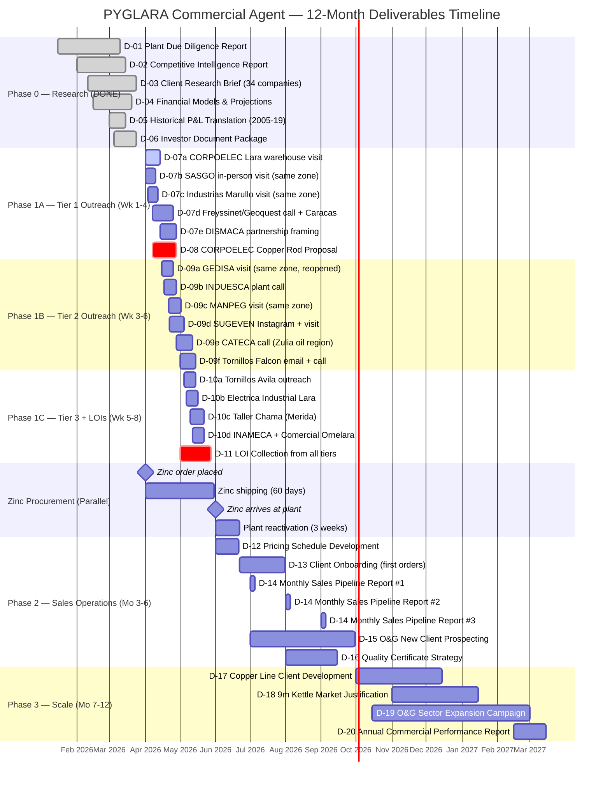
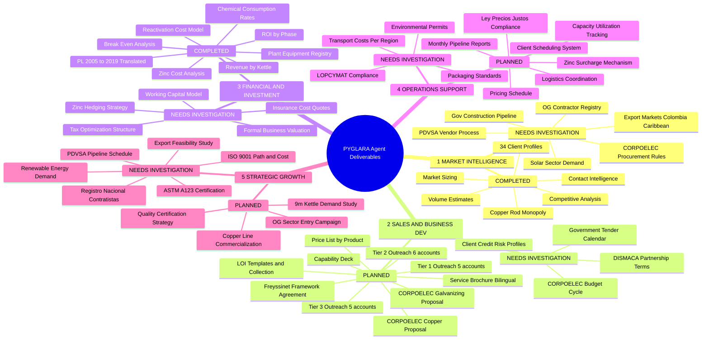
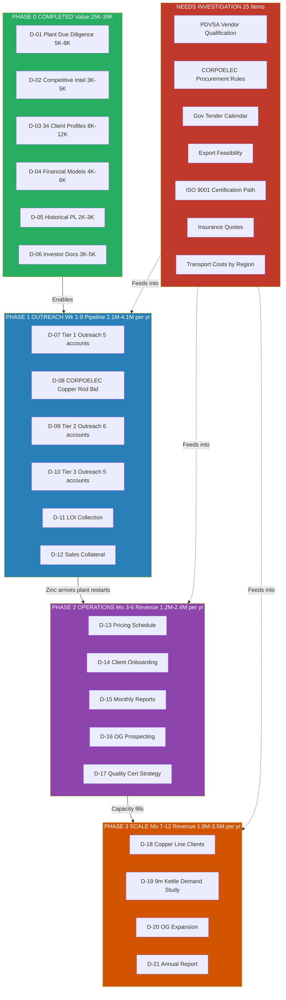

# PYGLARA — All Deliverable Diagrams

> Open this file, then press **Ctrl+Shift+V** to see the Markdown Preview with rendered diagrams.

---

## 1. Gantt Timeline — 12-Month Deliverables

---

## 2. Deliverables Tree — HAVE vs NEED

---

## 3. Phase Value Flow

---

## 4. WBS Color-Coded (57 Sub-Deliverables)

> Legend: Green = DONE | Blue = PLANNED | Purple = OPERATIONS | Orange = GROWTH | Red = INVESTIGATE

```mermaid
flowchart LR
    subgraph MI["1 MARKET INTELLIGENCE 9 items"]
        direction TB
        MI1["1.1 Competitive Analysis DONE"]
        MI2["1.2 Client Database 34co DONE"]
        MI3["1.3 Market Sizing DONE"]
        MI4["1.4 OG Registry INVESTIGATE"]
        MI5["1.5 PDVSA Vendor INVESTIGATE"]
        MI6["1.6 CORPOELEC Rules INVESTIGATE"]
        MI7["1.7 Solar Demand INVESTIGATE"]
        MI8["1.8 Gov Pipeline INVESTIGATE"]
        MI9["1.9 Export Markets INVESTIGATE"]
    end

    subgraph SD["2 SALES 14 items"]
        direction TB
        SD1["2.1 Tier1 5accts PLANNED"]
        SD2["2.2 Tier2 6accts PLANNED"]
        SD3["2.3 Tier3 5accts PLANNED"]
        SD4["2.4 Copper Bid PLANNED"]
        SD5["2.5 Galv Bid PLANNED"]
        SD6["2.6 Freyssinet PLANNED"]
        SD7["2.7 Brochure PLANNED"]
        SD8["2.8 Deck PLANNED"]
        SD9["2.9 PriceList PLANNED"]
        SD10["2.10 LOIs PLANNED"]
        SD11["2.11 DISMACA INVESTIGATE"]
        SD12["2.12 Tenders INVESTIGATE"]
        SD13["2.13 Budget INVESTIGATE"]
        SD14["2.14 Credit INVESTIGATE"]
    end

    subgraph FI["3 FINANCIAL 13 items"]
        direction TB
        FI1["3.1 Equipment DONE"]
        FI2["3.2 Reactivation DONE"]
        FI3["3.3 Zinc Cost DONE"]
        FI4["3.4 Chemicals DONE"]
        FI5["3.5 Revenue DONE"]
        FI6["3.6 BreakEven DONE"]
        FI7["3.7 ROI DONE"]
        FI8["3.8 History DONE"]
        FI9["3.9 Valuation INVESTIGATE"]
        FI10["3.10 Insurance INVESTIGATE"]
        FI11["3.11 WorkCap INVESTIGATE"]
        FI12["3.12 Tax INVESTIGATE"]
        FI13["3.13 Hedging INVESTIGATE"]
    end

    subgraph OP["4 OPERATIONS 11 items"]
        direction TB
        OP1["4.1 Pricing PLANNED"]
        OP2["4.2 Legal PLANNED"]
        OP3["4.3 ZincSurch PLANNED"]
        OP4["4.4 Scheduling PLANNED"]
        OP5["4.5 Logistics PLANNED"]
        OP6["4.6 Reports PLANNED"]
        OP7["4.7 Capacity PLANNED"]
        OP8["4.8 Transport INVESTIGATE"]
        OP9["4.9 Packaging INVESTIGATE"]
        OP10["4.10 LOPCYMAT INVESTIGATE"]
        OP11["4.11 EnvPermit INVESTIGATE"]
    end

    subgraph SG["5 GROWTH 10 items"]
        direction TB
        SG1["5.1 CopperClients PLANNED"]
        SG2["5.2 OG Entry PLANNED"]
        SG3["5.3 9mStudy PLANNED"]
        SG4["5.4 QualityCert PLANNED"]
        SG5["5.5 Export INVESTIGATE"]
        SG6["5.6 PDVSA INVESTIGATE"]
        SG7["5.7 Renewables INVESTIGATE"]
        SG8["5.8 RNC INVESTIGATE"]
        SG9["5.9 ISO9001 INVESTIGATE"]
        SG10["5.10 ASTM INVESTIGATE"]
    end

    style MI1 fill:#27ae60,color:#fff
    style MI2 fill:#27ae60,color:#fff
    style MI3 fill:#27ae60,color:#fff
    style MI4 fill:#c0392b,color:#fff
    style MI5 fill:#c0392b,color:#fff
    style MI6 fill:#c0392b,color:#fff
    style MI7 fill:#c0392b,color:#fff
    style MI8 fill:#c0392b,color:#fff
    style MI9 fill:#c0392b,color:#fff
    style FI1 fill:#27ae60,color:#fff
    style FI2 fill:#27ae60,color:#fff
    style FI3 fill:#27ae60,color:#fff
    style FI4 fill:#27ae60,color:#fff
    style FI5 fill:#27ae60,color:#fff
    style FI6 fill:#27ae60,color:#fff
    style FI7 fill:#27ae60,color:#fff
    style FI8 fill:#27ae60,color:#fff
    style FI9 fill:#c0392b,color:#fff
    style FI10 fill:#c0392b,color:#fff
    style FI11 fill:#c0392b,color:#fff
    style FI12 fill:#c0392b,color:#fff
    style FI13 fill:#c0392b,color:#fff
    style SD1 fill:#2980b9,color:#fff
    style SD2 fill:#2980b9,color:#fff
    style SD3 fill:#2980b9,color:#fff
    style SD4 fill:#2980b9,color:#fff
    style SD5 fill:#2980b9,color:#fff
    style SD6 fill:#2980b9,color:#fff
    style SD7 fill:#2980b9,color:#fff
    style SD8 fill:#2980b9,color:#fff
    style SD9 fill:#2980b9,color:#fff
    style SD10 fill:#2980b9,color:#fff
    style SD11 fill:#c0392b,color:#fff
    style SD12 fill:#c0392b,color:#fff
    style SD13 fill:#c0392b,color:#fff
    style SD14 fill:#c0392b,color:#fff
    style OP1 fill:#8e44ad,color:#fff
    style OP2 fill:#8e44ad,color:#fff
    style OP3 fill:#8e44ad,color:#fff
    style OP4 fill:#8e44ad,color:#fff
    style OP5 fill:#8e44ad,color:#fff
    style OP6 fill:#8e44ad,color:#fff
    style OP7 fill:#8e44ad,color:#fff
    style OP8 fill:#c0392b,color:#fff
    style OP9 fill:#c0392b,color:#fff
    style OP10 fill:#c0392b,color:#fff
    style OP11 fill:#c0392b,color:#fff
    style SG1 fill:#d35400,color:#fff
    style SG2 fill:#d35400,color:#fff
    style SG3 fill:#d35400,color:#fff
    style SG4 fill:#d35400,color:#fff
    style SG5 fill:#c0392b,color:#fff
    style SG6 fill:#c0392b,color:#fff
    style SG7 fill:#c0392b,color:#fff
    style SG8 fill:#c0392b,color:#fff
    style SG9 fill:#c0392b,color:#fff
    style SG10 fill:#c0392b,color:#fff
```

